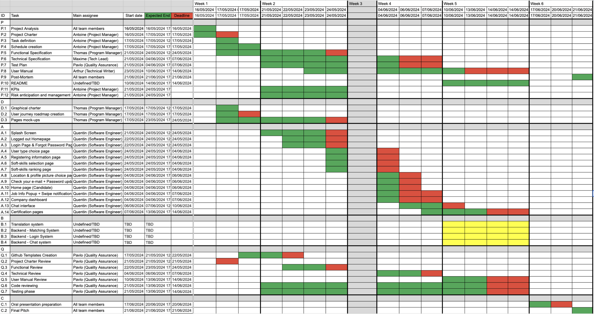
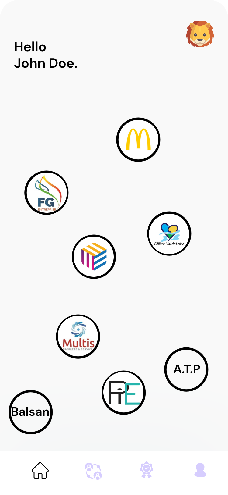
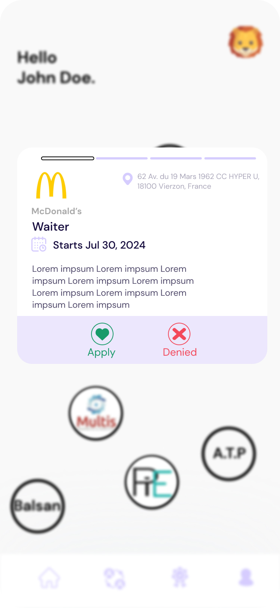
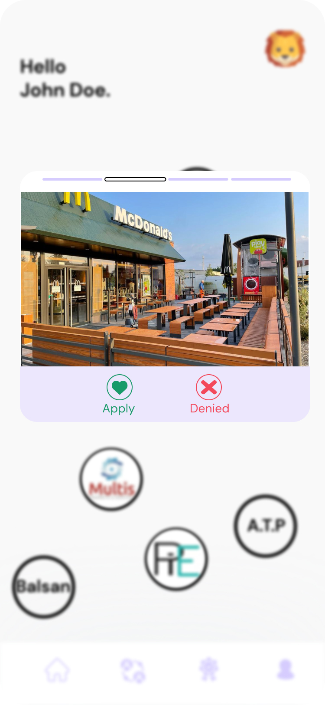
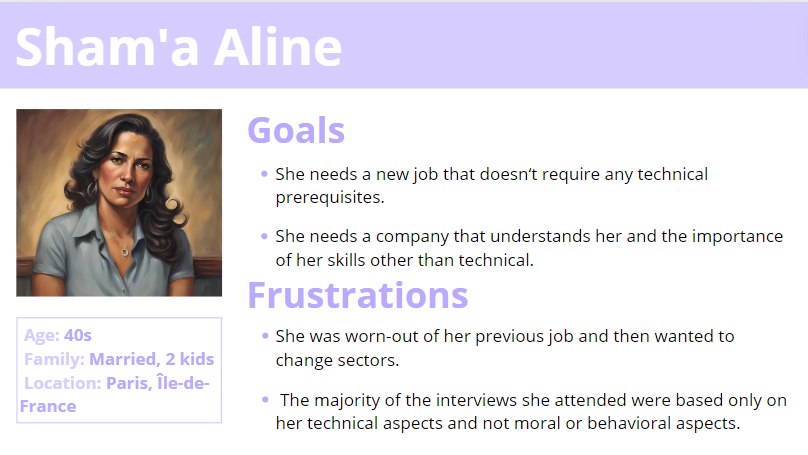
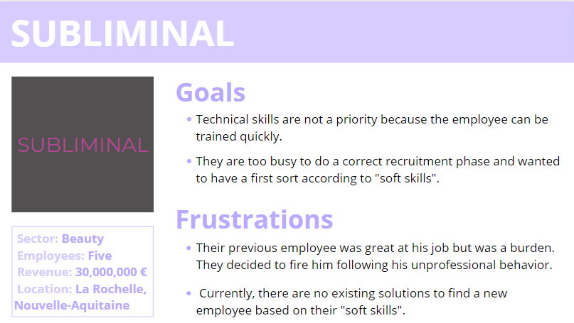
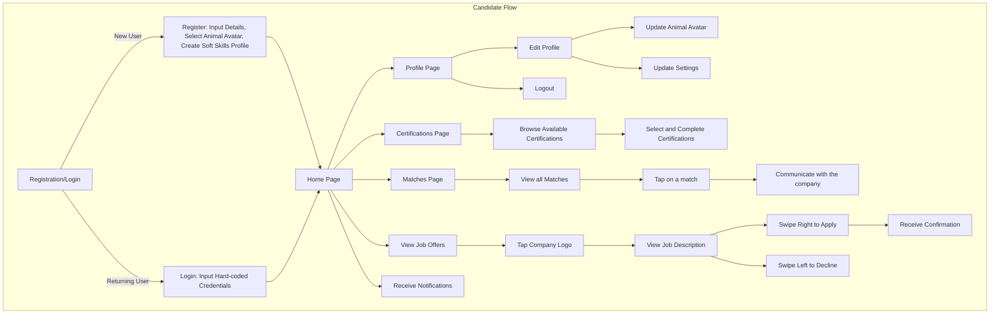
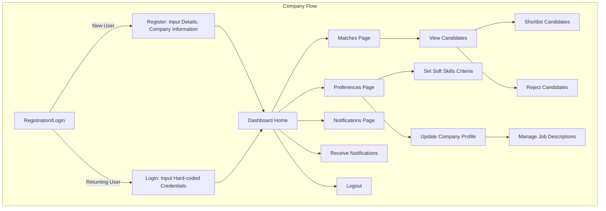

<!-- PROJECT LOGO -->
 

  <h1 align="center">Functional Specification</h1>
  

    <strong>Adopte 1 Candidat</strong>
     
  
  

- [I. Introduction](#i-introduction)
  - [1. Glossary](#1-glossary)
  - [2. Project Overview](#2-project-overview)
  - [3. Project Definition](#3-project-definition)
    - [➭ Vision](#-vision)
    - [➭ Objectives](#-objectives)
    - [➭ Scope](#-scope)
    - [➭ Target Audience](#-target-audience)
    - [➭ Deliverables](#-deliverables)
  - [4. Project Organisation](#4-project-organisation)
    - [➭ Project Representatives](#-project-representatives)
    - [➭ Stakeholders](#-stakeholders)
    - [➭ Project Roles](#-project-roles)
    - [➭ Project Reviewers](#-project-reviewers)
  - [5. Project Plan](#5-project-plan)
    - [➭ Retroplanning](#-retroplanning)
    - [➭ Milestones](#-milestones)
    - [➭ Dependencies](#-dependencies)
    - [➭ Assumptions/Constraints](#-assumptionsconstraints)
    - [➭ Risks / Mitigation](#-risks--mitigation)
- [II. UX/UI](#ii-uxui)
  - [1. Mockups](#1-mockups)
  - [2. Unique UI Feature:](#2-unique-ui-feature)
  - [3. Color Palette](#3-color-palette)
  - [4. Font](#4-font)
  - [5. Image Assets](#5-image-assets)
- [III. Functional Requirements](#iii-functional-requirements)
  - [1. Registration](#1-registration)
    - [➭ User Registration](#-user-registration)
      - [➭ Candidate Registration](#-candidate-registration)
      - [➭ Company Registration](#-company-registration)
  - [2. Job Offers](#2-job-offers)
    - [➭ Job List Candidate Side](#-job-list-candidate-side)
    - [➭ Job List Company Side](#-job-list-company-side)
    - [➭ Job Creation](#-job-creation)
    - [➭ Job Matching](#-job-matching)
    - [➭ Soft skills list](#-soft-skills-list)
  - [3. Match Management](#3-match-management)
    - [➭ Candidate Side](#-candidate-side)
    - [➭ Candidate Management Company Side](#-candidate-management-company-side)
    - [➭ Candidate Anonymity](#-candidate-anonymity)
  - [4. Soft Skills Assessment](#4-soft-skills-assessment)
    - [➭ Candidate Side](#-candidate-side-1)
    - [➭ Company Side](#-company-side)
  - [5. Profile](#5-profile)
    - [➭ Personal Information](#-personal-information)
    - [➭ Jobs Liked](#-jobs-liked)
    - [➭ Certifications Passed](#-certifications-passed)
    - [➭ Notifications](#-notifications)
    - [➭ Language Options](#-language-options)
  - [6. Device Compatibility](#6-device-compatibility)
    - [➭ Supported Devices](#-supported-devices)
    - [➭ Cross-Platform Compatibility](#-cross-platform-compatibility)
  - [7. Target Audience](#7-target-audience)
    - [➭ Job Seekers](#-job-seekers)
    - [➭ Companies](#-companies)
  - [8. User Workflow](#8-user-workflow)
- [IV. Non-Functional Requirements](#iv-non-functional-requirements)
  - [1. Security](#1-security)
  - [2. Performance](#2-performance)
    - [➭ Responsiveness](#-responsiveness)
    - [➭ Load Time](#-load-time)
  - [3. Market Analysis: Competitors and Differentiators.](#3-market-analysis-competitors-and-differentiators)
    - [➭ Market Landscape](#-market-landscape)
    - [➭ Differentiators](#-differentiators)
  - [4. Technical Requirements](#4-technical-requirements)
    - [➭ Technical Specifications](#-technical-specifications)
    - [➭ Constraints and Limitations](#-constraints-and-limitations)

## I. Introduction

### 1. Glossary

| Term                                | Definition                                                                                                              |
|-------------------------------------|-------------------------------------------------------------------------------------------------------------------------|
| Soft skills                         | Non-technical skills related to interpersonal communication, teamwork, problem-solving, adaptability, etc.            |
| Dashboard                           | A visual interface that provides an overview of important information and key metrics, often used for monitoring.       |
| Contract type                       | The classification of employment agreements, such as full-time, part-time, temporary, or freelance contracts.         |
| Cross-platform framework            | A software development framework that allows for the creation of applications compatible with multiple platforms.      |
| Encryption algorithms               | Mathematical procedures used to encode data, ensuring that only authorized parties can access and decipher it.       |
| APIs                                | Application Programming Interfaces (APIs) define how different software components interact and communicate with each other. |
| Multi-factor authentication (MFA)   | A security measure that requires users to provide multiple forms of identification (e.g., password and SMS code) to access an account. |
| Role-based access control (RBAC)    | A method of restricting system access based on the roles of individual users within an organization.                    |
| Single codebase                     | A development approach where a single source code is used to build applications for multiple platforms or environments. |
| Dart programming language           | A programming language developed by Google, commonly used with the Flutter framework for building cross-platform applications. |
| Simulated database                  | A placeholder or imitation database used for development and testing purposes, mimicking the behavior of a real database. |

### 2. Project Overview

This project aims to create a Tinder-like recruitment app valuing soft skills rather than hard skills.

The client is the company "[We Are Evolution.](https://www.we-are-evolution.com/)", a creative employer branding agency. Our 
contact point is Lilou Jourdannaud, the communication intern.

### 3. Project Definition

#### ➭ Vision

The vision of the "Adopte Un Candidat" Project is to transform and 
enhance the job recruitment process by emphasizing behavioral aspects 
over technical skills. This approach aims to help companies identify 
employees with strong mental attributes and positive behaviors, thereby 
fostering a healthy and productive work environment. By prioritizing 
these qualities, the project seeks to create a positive workplace 
atmosphere, leading to increased productivity and overall job 
satisfaction.

This application assists companies in finding new employees by focusing 
on various soft skills. It enables companies to prioritize the most 
relevant soft skills from a predefined list based on their specific 
requirements for potential employees.

#### ➭ Objectives

- **Anonymization of candidates**: To avoid discrimination in hiring, 
  candidates are anonymized on the platform. This allows us to focus on 
  candidates' skills and potential, rather than their origin, gender, 
  age, etc.

- **Valuing soft skills**: The concept focuses on emphasizing soft 
  skills over diplomas and experience. Soft skills will be the sole 
  criteria used in the matching system to ensure effective and 
  meaningful placements.

- **Using an application**: The entire recruitment process takes place 
  on a dedicated application. This facilitates interaction between 
  candidates and companies.

#### ➭ Scope

This project will be developed using Flutter, a cross-platform framework, ensuring the application is available on computer, iOS, and Android. 

The implementation will focus solely on the front-end and provide interfaces for both candidates and companies.

#### ➭ Target Audience

**Job Seekers:** Individuals looking for employment, particularly those with limited formal qualifications and those who face various forms of discrimination that reduce their chances of getting an interview. These candidates are technologically savvy and comfortable using an app to find job opportunities. They need a platform to highlight their soft skills, maintain anonymity, and browse relevant job opportunities easily.

**Companies:** Companies that have difficulty finding candidates using the normal hiring method. They need a solution to find a large number of candidates who match their values and the soft skills required for the position. They are ready to judge people solely on their general skills and put everything else aside.

#### ➭ Deliverables

The main deliverable is the source code of the application. In addition, to ensure we stay on the right track, we will submit multiple mock-ups and prototypes to the client.

Additional documents will be given to the client:

- Functional Specification
- Technical Specification
- Test Plan
- User Manual
- Management Planning & Weekly reports

In addition, a presentation of our work will be done to the client as a 15-minute long presentation.

### 4. Project Organisation

#### ➭ Project Representatives

| Full Name        | Occupation               | Links                                                               |
| ---------------- | ------------------------ | ------------------------------------------------------------------- |
| Antoine PREVOST  | Project manager          | [LinkedIn](https://www.linkedin.com/in/antoine-prevost-dev/)        |
| Thomas PLANCHARD | Program manager          | [LinkedIn](https://linkedin.com/in/thomas-planchard-461782221/)     |
| Maxime THIZEAU   | Tech lead                | [LinkedIn](https://linkedin.com/in/maxime-thizeau-0b311a293)        |
| Quentin CLEMENT  | Senior software engineer | [LinkedIn](https://linkedin.com/in/quentin-cl%C3%A9ment-939110221/) |
| Pavlo PRENDI     | Quality assurance        | [LinkedIn](https://www.linkedin.com/in/pavlo-prendi-674777309/)     |
| Arthur LEMOINE   | Technical writer         | [LinkedIn](https://www.linkedin.com/in/arthur-lemoine-4b9782221/)   |

#### ➭ Stakeholders

| Role            | Representative                        | Expectation                                                            |
| --------------- | ------------------------------------- | ---------------------------------------------------------------------- |
| Client          | Lilou Jourdannaud (We Are Evolution.) | Finished project meeting requirements                                  |
| School director | Franck JEANNIN (ALGOSUP)              | Clear documentation and management based on the skills learnt in class |

#### ➭ Project Roles

| Role                   | Description                                                                                   | Name |
| ---------------------- | --------------------------------------------------------------------------------------------- | -----|
| Project Manager        | Responsible for the overall planning, execution, and success of the project.                  | Antoine PREVOST |
| Program Manager        | Makes sure the project meets expectation.   Is in charge of design. Is responsible for writing the Functional Specifications              | Thomas PLANCHARD |
| Tech Lead              | Makes the technical decision in the project.   Translates the Functional Specification into Technical Specifications.   Does code review. | Maxime THIZEAU |
| Senior Software Engineer | Writes the code.   Writes documentation.   Participate in the technical design. | Quentin CLEMENT |
| Quality Assurance      | Tests all the functionalities of a product to find bugs and issues.   Document bugs and issues.   Write the test plan.   Check that issues have been fixed.     | Pavlo PRENDI |
| Technical Writer       | Responsible for creating and maintaining the project's documentation.                        | Arthur LEMOINE |

#### ➭ Project Reviewers

External project reviewers have been appointed by the project owner to review our specifications and provide us with feedback.

### 5. Project Plan

#### ➭ Retroplanning

**End Goal and Deadline**:

Launch of the new "Adopte un Candidat" application by June 21, 2024.

**Key Milestones**:

- Final Testing completed by June 14, 2024.
- Final Product codebase completed by June 12, 2024.
- Functional Specification completed by May 24, 2024.

**Task Breakdown**:

- Correcting codebase product from June 12 to June 14, 2024.
- Testing codebase product from June 12 to June 14, 2024.
- Implementing Nice-to-have features from June 10 to June 12, 2024.
- Implementing core features from June 7 to June 12, 2024.
- Reviewing Functional Specification from May 23 to May 24, 2024.
- Defining Functional Specification from May 14 to May 23, 2024.
- Creating the mock-up from May 14 to May 21, 2024.

**Critical Path**:

- Core feature development must be completed before final testing.
- Mock-up must be completed before Implementing Core features.

**Timeline Visualization**:

#### ➭ Milestones

| Date       | Time   | Milestones                        |
| ---------- | ------ | --------------------------------- |
| 05/13/2024 | 9 A.M. | Project kick-off with the client  |
| 05/24/2024 | 5 P.M. | Functional Specification delivery |
| 06/07/2024 | 5 P.M. | Technical Specification delivery  |
| 06/07/2024 | 5 P.M. | Test Plan delivery                |
| 06/14/2024 | 5 P.M. | Final product codebase delivery   |
| 06/14/2024 | 5 P.M. | User Manual Delivery              |
| 06/21/2024 | 9 A.M. | Final Presentation Pitch          |

#### ➭ Dependencies

**Task Dependencies**:

- Final Testing cannot start until Core Feature Development is complete.
- Nice-to-have features cannot start until Core Feature Development is complete.
- Core Feature Development cannot start until the mock-up is approved.

**Resource Dependencies**:

- QA Team must be available for continuous testing from June 7 to June 14, 2024.
- Tech Lead must be available for code review from June 12 to June 14, 2024.

#### ➭ Assumptions/Constraints

**Assumptions**:

- *Business Plan:*
    The team will assume the application will be free when released so the creation of a business plan is not useful.

- *Candidate Engagement:*
    Candidates will accurately and honestly assess their soft skills during the registration process.

- *Company Needs:*
    Companies have a clear understanding of the soft skills they require for their positions and will accurately define their preferences.

- *Predefined Lists:*
    The predefined lists of soft skills and animal avatars will be comprehensive and sufficient for both candidates and companies.

- *Internet Access:*
    Users will have reliable internet access to use the application effectively.

- *Feedback and Iteration:*
    Users will provide feedback on their experience, which can be used for future iterations and improvements of the application.

- *Technical Constraints:*
    The technical limitations of Flutter will not significantly hinder the implementation of the required front-end features

**Constraints**:

- *Scope Limitations:*
    The project will focus exclusively on front-end development using Flutter.
    Backend functionality, including database management and server-side logic, will not be implemented in this phase.

- *Authentication:*
    A robust authentication system will not be developed. Instead, hard-coded login credentials will be used to simulate user authentication.

- *Platform Compatibility:*
    The application must be compatible with desktop, iOS, and Android platforms.

- *Data Privacy:*
Candidates' personal information must remain confidential. Companies will only have access to soft skill profiles, unique user IDs, and selected animal avatars.

#### ➭ Risks / Mitigation

| ID  | Description  | Consequence | Impact   | Likelihood | Mitigation/Avoidance     |
| --- | ------------------------------------- | --------------------------- | -------- | ---------- | ---------------------------------- |
| 1   | Flutter is a language to which we are not yet used to.                          | Development pace might be hindered                                | High     | Medium     | Ask for help from the other team members                                              |
| 2   | The client might want to change /add requirements                              | We might need to change how the solution is developed             | Medium   | Low        | Validate every step of the project with the client, to ensure the solution fits their requirements |
| 3   | We might create a clone of an already exisiting solution and infringe a patent | The client couldn't develop their solution based on our prototype | High     | Low        | Check for any patent and find our unique selling point (USP)                        |
| 4   | Misinterpretation of the project                                               | Incorrect implementation of the software                          | Critical | Medium     | Regular communication with the client to understand their needs, and stick to them. |
| 5   | Team member leaving                                                            | Tasks left to the remaining members without any assignee          | High     | Unlikely   | Sharing the tasks among the remaining team members.                                 |

## II. UX/UI

### 1. Mockups

The mockups for the application can be accessed via the following link: [Mockup PDF](./Adopte1CandidatMockup.pdf)

The mockups are organized in the order of the user workflow, starting from registration/login and progressing through profile creation, soft skills selection...

### 2. Unique UI Feature:

To enhance user engagement, we've designed Job Offer Bubbles, a unique feature in the app:

- **Description**: Animated bubbles bounce slowly across the screen, representing job offers.
- **Interaction**: Users click on bubbles to view job details in a pop-up window.
- **Navigation**: Within the pop-up, users can swipe through job images.
- **Acceptance**: Accept or decline job offers by clicking the corresponding buttons.

This feature adds a dynamic and playful element to the app, making job browsing more interactive and enjoyable for candidates.

### 3. Color Palette

The color palette for the application is as follows:
- Primary Color: #D6CDFE (Light Purple) 
- Secondary Color: #000000 (Black)
- Background Color: #F9F9F9 (Light Grey)
- Text Color: Black (#000000) for primary text, White (#FFFFFF) for secondary text

### 4. Font 

We will use DM Sans as the primary font for the application.

### 5. Image Assets

All images used in the application are available in a dedicated folder accessible via the following link: [Image Assets Folder](./img/app_img/)

## III. Functional Requirements

### 1. Registration

#### ➭ User Registration

To register for the application, the process would differ based on the user's role, whether they are a Company or a Candidate.

##### ➭ Candidate Registration

To register a new candidate account, there will be five steps:

1. **Email and Password Registration**: Users will provide an email address, a password, and a full name (which will be hidden later).

2. **Soft Skills Selection**: Candidates will choose a total of fifteen soft skills from a list of forty. They will then organize these selected skills from the most proficient to the least proficient.

3. **Location Selection**: Candidates will select their location and define a range around it to identify potential nearby companies.

4. **Avatar Selection**: Users will choose an avatar from a selection of twelve animals, reflecting their mentality and self-perception.

5. **Email Confirmation**: Upon completing all steps, candidates will receive an email in their mailbox to confirm their registration.

After the registration process, the user will be redirected to the home page.

##### ➭ Company Registration

Registering as a company is straightforward:

1. **Registration**: Provide an email, password, company name, and company registration (SIRET) number.
2. **Logo Submission**: Upload the company logo.
3. **Email Confirmation**: Receive a confirmation email to complete registration.

After registration, the company will be redirected to the dashboard home page.

### 2. Job Offers

#### ➭ Job List Candidate Side

Upon logging in, users will see the main feature of the application: job offers presented as bubbles. These offers are sorted based on the user's specified location during account creation. Users can click on a bubble to view details and decide whether to apply or decline. Accepting a job offer makes the user's profile visible to the company, which they can then decide to initiate communication. To avoid overwhelming users, the app limits the displayed job offer bubbles to 8 at a time. Declining an offer removes the bubble and replaces it with another.

#### ➭ Job List Company Side

Upon logging in, companies are directed to the same home page layout as the candidate side. However, instead of job offer bubbles, companies are presented with a list of all their active job offers. This list includes the number of candidates who have liked each offer.

Companies can sort their job offers based on criteria such as creation date or the number of candidates who have liked each offer. This functionality allows companies to efficiently manage their job postings and prioritize those that are generating the most interest from candidates.

#### ➭ Job Creation

New companies, starting without any job offers, will need to create new listings. To do so, they'll click on the "Add Offer" button on the home page, which redirects them to a page where they can input various job details. These details include the job title, company name, start and end dates, contract type, location, and job description.

Additionally, companies will specify the soft skills they seek for the job. Optionally, they can include pictures of the workplace to provide further context to potential candidates. Once the offer creation process is complete, the job listing will be posted on the application for candidates to view and apply.

#### ➭ Job Matching

As a "Tinder-like" application, a match system is essential. The system functions as follows:

First, the app performs a preliminary match based on the location provided by the candidate and the location specified by the company for the job offer. The home page of the job-seeker displays these preliminary matches using "bubbles" that contain the companies' logos.

The application then matches job-seekers and job offers based on the soft skills sought. Companies can select two "categories" of soft skills for their job offers, and job-seekers can choose specific soft skills from a list. Each soft skill in this list corresponds to a particular category, though candidates will not see the categories themselves.

   1. **Focused Recruitment**: By allowing companies to select two "categories" of soft skills, the application helps employers target candidates with the most relevant behavioral traits and competencies, ensuring a better fit for the job and company culture.

   2. **Streamlined Process**: Candidates choose specific soft skills from a predefined list, simplifying the process and reducing ambiguity. This approach helps candidates highlight their strengths effectively.

   3. **Enhanced Matching Accuracy**: Each soft skill in the list corresponds to a specific category, though candidates are unaware of these categories. This design ensures that matches are based on genuine skill alignment rather than candidate guesswork, leading to more accurate and meaningful connections.

   4. **Objective Evaluation**: Focusing on soft skills levels the playing field, especially for candidates with limited formal qualifications or experience. This method emphasizes intrinsic qualities that contribute to job performance and team dynamics.

   5. **Reduction of Bias**: By focusing on soft skills rather than traditional qualifications, the application helps reduce biases related to education, work history, and other factors, promoting diversity and inclusion in the hiring process.

A "match" is established if at least four soft skills of a job-seeker fall within the categories the company is looking for. This system ensures that both parties find suitable and relevant matches, enhancing the overall recruitment experience.

#### ➭ Soft skills list

Here are the soft skills that the user can select from and the categories they belong to:

| Categories         | Soft Skils                            |
| ------------------ | ------------------------------------- |
| LEADERSHIP         | Influence                             |
|                    | Self-Confidence                       |
|                    | Communication                         |
|                    | Judgment                              |
|                    | Empathy                               |
| Efficiency         | Efficiency                            |
|                    | ability to focus                      |
|                    | Time management                       |
|                    | Stress management                     |
|                    | Sense of priorities                   |
|                    | Being organised                       |
|                    | Know how to organise                  |
|                    | Ability to concentrate                |
|                    | Meeting deadlines                     |
|                    | Pressure handling                     |
|                    | Process optimisation                  |
|                    | Ability to delegate / entrust         |
|                    | Problem solving                       |
|                    | File management                       |
| Social competences | Teamwork                              |
|                    | Team Spirit                           |
|                    | Sense of service                      |
|                    | Coordination                          |
|                    | Ability to infer confidence           |
|                    | Being engaged                         |
|                    | Ability to create human relationships |
|                    | Cooperation & collaboration           |
| Agile competences  | Flexibility                           |
|                    | Adaptability (when facing changes)    |
|                    | Being open to changes                 |
|                    | Self-reflective                       |
|                    | Anticipation                          |
|                    | Innovation                            |
|                    | Creativity                            |
|                    | Optimism                              |
|                    | Self-improvement                      |
|                    | Getting out of comfort-zone           |
|                    | Audacity                              |
|                    | Curiosity                             |
|                    | Risk-taking                           |

### 3. Match Management

#### ➭ Candidate Side

All matches that a user receives will be displayed on the "Matches" page, accessible from the navigation bar on the home page. Users will be notified of new matches through notifications. On the "Matches" page, all conversations related to job offers will be displayed. 

Users can select a conversation to chat with the company or remove a conversation if they no longer wish to engage with that company. At this stage, the user remains anonymous to the company until they decide to advance the conversation to the next step, such as scheduling an interview or sharing their CV.

#### ➭ Candidate Management Company Side

The "Matches" page on the company side will have a distinct layout and functionality. Companies will have access to all candidates who have liked their job offers. These candidates will be automatically sorted by the app according to the number of soft skills they have in common with the job offer. This feature simplifies the company's workflow and provides a clear overview of the most relevant candidates.

If no candidates meet the company's expectations, a separate category on the same page will display those who liked the job offer but do not match the required soft skills. This allows companies in critical situations to consider candidates who may not meet all the soft skill criteria but still show interest in the position.

Companies can view candidates' profiles, including their soft skills and avatars. They can also see any certifications the candidates have obtained. Companies can shortlist candidates they are interested in, reject others, and initiate communication with selected candidates by sending messages. This comprehensive view and interaction capability helps companies efficiently manage their recruitment process.

#### ➭ Candidate Anonymity

According to the requirements and the application's focus on "soft skills," companies will not have access to candidates' personal information at any time. This includes real names, email addresses, and locations. The only information companies will have access to includes the candidate's avatar picture, selected "soft skills" and certifications obtained within the app. 

### 4. Soft Skills Assessment

We are introducing a soft skills assessment feature within the app to allow candidates to evaluate their skills according to the needs of companies. This feature mimics the LinkedIn assessment process.

#### ➭ Candidate Side

On the certification page, candidates can choose a category of soft skills they want to be certified in. The available categories include:

- Communication
- Leadership
- Agile Efficiency
- Management
- Oral Skills

Once a category is selected, a list of all certifications related to that category will be displayed. Each certification is designed as a multiple-choice questionnaire (MCQ). After completing the MCQ, candidates will be notified whether they have passed. Successful certifications can then be added to their app profile, enhancing their appeal to potential employers.

#### ➭ Company Side

Companies will also have access to the certification feature. They can choose a category and create their own certifications tailored to their specific needs. This guarantees that candidates who pass the company's customized assessments have the precise soft skills required for the job, leading to a better match between candidates and job requirements.

### 5. Profile 

The profile page, accessible from the navigation bar on the home page, serves as a centralized hub for all user-related information. Additionally, users can log out from this page. The profile page is divided into several sections:

#### ➭ Personal Information

This section displays the user's basic information: name, email, password, and location. Users will have the ability to modify this information according to their needs, ensuring their profile is always up-to-date and accurate.

#### ➭ Jobs Liked

Here, users can view the list of job offers they have liked. This section helps users keep track of the opportunities they are interested in, facilitating easy access and management of their job applications.

#### ➭ Certifications Passed 

This section displays all certifications the user has passed. Users can view the details of each certification, including the category, certification name, and date of completion.

#### ➭ Notifications

To keep users engaged and informed about their activity on the app, we have implemented a notification system. This list of notifications is not exhaustive and can be expanded or reduced according to user needs.

| Notification Type             | Notification Content                                                       |
|-------------------------------|----------------------------------------------------------------------------|
| New Match                     | Hey! Come back to the application, you have a new match!                   |
| New Message                   | Hey! Come back to the application, you have a new message!                 |
| Long Time No See              | Hi... It's been a long time since we last saw you on the application. Did you find a job? |
| New Job Available             | Hey! Come back to the application, there is a new job opening in your area! |
| New Certification Available   | This company sent you a new certification. Come back and take the test!    |
| Job Application Denied        | Hi... Your application has been denied. Come find other opportunities.     |
| Job Application Accepted      | Hi... Your application has been accepted. Come talk to the company!       |

Users have the option to turn off notifications on the profile page of the app.

#### ➭ Language Options

Since the targeted audience for this application is France, it was meant to be in the French language at first.
However, to facilitate the expansion of the application in foreign countries, a language setting was added.
Once the product is launched, there will be an option between French and English.
Other languages could be implemented afterwards, depending on which country would use the application.

To change the language option, access to the settings will be created on the settings page.

### 6. Device Compatibility

#### ➭ Supported Devices

The application should be accessible on computers, iOS devices, and Android devices. Candidates are likely to use it mainly on their mobile phones, while companies are expected to primarily use it on computers for ease and productivity.

#### ➭ Cross-Platform Compatibility

The app must ensure compatibility with all iPhones currently supported by the latest version of iOS. This includes iPhones running iOS 13 
and above, as statistics show that over 90% of iPhone users have adopted iOS 13 or later versions. Similarly, for Android devices, the app 
should be compatible with devices running Android 8.0 (Oreo) and newer versions, considering that around 85% of Android users are on Android 
8.0 or higher.

Regarding computer usage, the app should be accessible on widely used web browsers such as Google Chrome, Safari, Mozilla Firefox, and 
Microsoft Edge. Data reveals that these browsers collectively account for over 95% of global web traffic on desktop and laptop devices. 
Therefore, compatibility with these browsers will maximize the app's reach and accessibility across various platforms.

### 7. Target Audience

#### ➭ Job Seekers

**Perona 1 - Warrick Ryder**:

**Perona 2 - Sham'a Aline**:

#### ➭ Companies

**Perona 3 - SUBLIMINAL**:

### 8. User Workflow 

## IV. Non-Functional Requirements

### 1. Security 

For the project, the primary focus is on front-end development, with minimal attention to back-end implementation. As a result, security features may not be prioritized or fully implemented in the initial version of the application. However, some ideas for enhancing security in future iterations include:

1. **Authentication System**:
   - Employing industry-standard authentication protocols such as OAuth and OpenID Connect.
   - Implementation of multi-factor authentication (MFA) adds an additional layer of security.
   - Utilizing secure token-based authentication mechanisms like JSON Web Tokens (JWT) protects against common threats like session hijacking.

2. **Data Encryption**:
   - Advanced encryption algorithms such as AES with strong key management practices.

3. **Secure Communication**:
   - Secure communication protocols like HTTPS establish a secure and encrypted channel for data transmission between the client and server.
   - Integration of TLS/SSL certificates from reputable certificate authorities (CAs) ensures the authenticity and integrity of the communication channel.
   - Implementation of Perfect Forward Secrecy (PFS) protocols protects against the compromise of past session keys.

4. **Input Validation**:
   - Input validation mechanisms sanitize and validate user input to prevent common security vulnerabilities such as SQL injection and cross-site scripting (XSS) attacks.
   - Parameterized queries and stored procedures for database interactions mitigate the risk of SQL injection by separating data from SQL commands.

5. **Authorization Controls**:
   - Authorization controls govern user access to application resources and functionalities based on predefined roles and permissions.
   - Role-based access control (RBAC) models assign users specific roles with associated permissions.

### 2. Performance

#### ➭ Responsiveness

The responsiveness of an application refers to its ability to quickly respond to user interactions and provide smooth and seamless user experiences across different devices and platforms.

**Industry Standards and Device-specific Data:**
- **Windows, macOS, Linux**: Desktop platforms typically aim for responsiveness in the range of 50-200 milliseconds (ms), ensuring smooth interactions and minimal delay in user feedback.
- **Android, iOS**: Mobile platforms prioritize even faster responsiveness, typically targeting response times between 70-250ms to deliver fluid and intuitive user experiences.

**Impact of Responsiveness on User Experience:**
- **Fast Response Times**: Users perceive an application as more efficient and user-friendly when interactions yield immediate responses, enhancing overall satisfaction and usability.
- **Slow Response Times**: Delays in responsiveness can lead to frustration and dissatisfaction among users, resulting in lower engagement and an increased likelihood of abandoning the app.

**Target Responsiveness:**
Considering the requirements and user expectations, the target responsiveness for the app across different platforms should be:
- **Desktop Platforms (Windows, macOS, Linux)**: Aim for response times within the range of 100-200ms.
- **Mobile Platforms (Android, iOS)**: Target faster response times between 70-150ms.

#### ➭ Load Time

The load time of an application is a critical factor that directly impacts user engagement and retention. It's essential to ensure that the load time is minimized to enhance the user experience and maintain interest.

**Industry Standards and Competitor Data:**
- **LinkedIn**: LinkedIn aims for a load time of under 2 seconds on mobile devices. Research indicates that a load time longer than this can result in a significant drop in user engagement.
- **Indeed**: Indeed strives for a load time of around 3 seconds. Their data suggests that each additional second of load time can decrease user satisfaction by up to 7%.
- **Glassdoor**: Glassdoor maintains an optimal load time of under 2.5 seconds, understanding that delays beyond this threshold can lead to higher bounce rates and lower user retention.

**Impact of Load Time on User Interest:**
Studies show that if an app's load time exceeds 3 seconds, users are likely to lose interest and abandon the application. Specifically:
- **1-3 seconds**: Optimal load time; highest user retention and satisfaction.
- **3-5 seconds**: Noticeable delay; potential drop in user engagement by up to 30%.
- **5+ seconds**: Significant delay; can lead to a drop in interest by more than 50% and increased likelihood of users abandoning the app entirely.

**Target Load Time:**
To ensure a competitive edge and high user retention, the app should target a load time of under 2.5 seconds. Achieving this will:
- Enhance user satisfaction.
- Improve user retention rates.
- Increase the likelihood of positive user reviews and recommendations.

### 3. Market Analysis: Competitors and Differentiators.

#### ➭ Market Landscape 

The job-matching app market has evolved significantly over the past decade, with a growing emphasis on the importance of soft skills alongside technical qualifications. This shift is driven by the recognition that soft skills—such as communication, leadership, and teamwork—are critical for long-term job success and cultural fit within companies. As a result, several innovative platforms have emerged, leveraging advanced technologies such as artificial intelligence (AI), machine learning, and gamified assessments to enhance the recruitment process.

| **App Name**            | **Audience**                                  | **Launch Date** | **Main Characteristics**                                                                                                                                         |
|-------------------------|-----------------------------------------------|-----------------|-------------------------------------------------------------------------------------------------------------------------------------------------------------------|
| **Pymetrics**           | Job seekers and recruiters                    | 2013            | Uses neuroscience-based games to assess cognitive and emotional traits, matching candidates to jobs where they would excel.                                       |
| **Good&Co**             | Job seekers, companies                        | 2012            | Offers personality quizzes to assess fit with company culture and team dynamics, providing insights into workplace compatibility.                                 |
| **HireVue**             | Employers, HR professionals                    | 2004            | Utilizes AI-driven video assessments and gamified cognitive tests to evaluate candidates' soft skills and predict job performance.                                |
| **WayUp**               | College students, recent graduates            | 2014            | Focuses on entry-level jobs and internships, offering skill assessments and employer-matching based on candidates' profiles and interests.                        |
| **Vervoe**              | Employers, job seekers                        | 2016            | Conducts skill assessments and job simulations to evaluate candidates' abilities and fit for specific roles, emphasizing practical skills over traditional resumes.|
| **Soft Skills**         | Job seekers, companies                        | 2020            | Aims to match candidates with job offers based on their soft skills, providing both parties with detailed insights into personality and compatibility.             |
| **JobGet**              | Hourly workers, employers in service industries| 2019            | Offers a quick application process, focusing on immediate hires and soft skill compatibility for roles in retail, hospitality, and customer service sectors.     |
| **Leap.ai**             | Tech professionals, employers                 | 2017            | Uses AI to match candidates with jobs based on soft skills, career goals, and company culture, emphasizing personalized career development.                       |

These apps focus on the importance of soft skills in the hiring process, leveraging various innovative methods to assess and match candidates based on their behavioral traits, cognitive abilities, and cultural fit with potential employers.

#### ➭ Differentiators

- **Soft Skills-First Approach**
Unlike many traditional job matching apps that emphasize technical skills and work experience, Adopte 1 Candidat focuses primarily on soft skills. This approach aligns with the growing recognition that interpersonal abilities and emotional intelligence are critical for job performance and workplace harmony.

- **Innovative Matching System**
Adopte 1 Candidat employs a "Tinder-like" matching system, where candidates and job offers are displayed as bubbles. This engaging and interactive design makes the job search process more enjoyable and visually appealing. The bubble system ensures that users are not overwhelmed by numerous job offers at once, maintaining focus and simplicity.

-  **Anonymous Matching**
To prioritize privacy and unbiased evaluation, candidates remain anonymous to companies until a match is made and both parties decide to proceed with communication. This feature helps reduce potential biases based on personal information, allowing soft skills and job fit to drive the initial stages of the recruitment process.

- **Customizable Soft Skills Assessments**
Adopte 1 Candidat allows both candidates and companies to create and take custom soft skills assessments. Candidates can take assessments to validate their skills, similar to LinkedIn's assessment feature, and display their certifications on their profiles. Companies can also create their own assessments tailored to specific job roles, ensuring that candidates meet their unique requirements.

- 5. **User-Centric Design**
The app's user interface is designed to be intuitive and user-friendly, with a focus on providing a seamless experience. The use of a light purple and light grey color palette, along with clean and modern design elements, ensures that the app is visually appealing and easy to navigate.

- 6. **Focus on Inclusive Hiring**
Adopte 1 Candidat aims to assist job seekers who may face discrimination based on traditional qualifications or other biases. By emphasizing soft skills and anonymous matching, the app helps level the playing field, providing equal opportunities for all candidates, particularly those with limited formal qualifications or who face hiring biases.

### 4. Technical Requirements

The project will be developed using Flutter. Flutter allows for the creation of natively compiled applications from a single codebase, which is particularly advantageous for this project, given its requirement to support multiple platforms including iOS, Android, and desktop environments.

**Why Flutter?**
- **Cross-Platform Compatibility**: Flutter enables the development of applications that work seamlessly on iOS, Android, and desktop platforms.
- **Single Codebase**: By writing code once and deploying it across various platforms, Flutter significantly reduces development time and effort, making it an efficient choice for a project with limited resources.
- **Rich UI Components**: Flutter's extensive library of pre-designed widgets and its capability to create custom widgets allow for a highly customizable and responsive user interface.

#### ➭ Technical Specifications
- **Development Framework**: Flutter
- **Programming Language**: Dart
- **Target Platforms**: iOS, Android, Desktop (Windows, macOS, Linux)
- **Database**: Simulated for the scope of this project (potential future integration with a backend database)
- **Authentication**: Simulated for the scope of this project (potential future integration with a secure authentication service)
- **APIs**: Placeholder APIs for simulating backend interactions (potential future integration with Monkey Tie APIs)

#### ➭ Constraints and Limitations
- **Scope Limitation**: The current project scope is limited to the frontend implementation and a simulated backend for authentication and data storage.
- **Resource Constraints**: As a school project, the development team is restricted by time and resource availability.
- **Mandatory Framework**: The use of Flutter is a requirement imposed by the educational context of the project.
