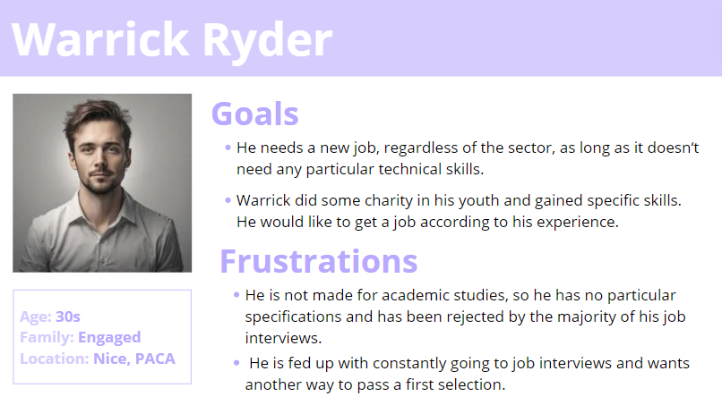

<!-- PROJECT LOGO -->
 

  <h1 align="center">Functional Specification</h1>
  

    <strong>Adopte 1 Candidat</strong>
     
  
  

- [I. Introduction](#i-introduction)
  - [1. Glossary](#1-glossary)
  - [2. Project Overview](#2-project-overview)
  - [3. Project Definition](#3-project-definition)
    - [➭ Vision](#-vision)
    - [➭ Objectives](#-objectives)
    - [➭ Scope](#-scope)
    - [➭ Target Audience](#-target-audience)
    - [➭ Deliverables](#-deliverables)
  - [4. Project Organisation](#4-project-organisation)
    - [➭ Project Representatives](#-project-representatives)
    - [➭ Stakeholders](#-stakeholders)
    - [➭ Project Roles](#-project-roles)
    - [➭ Project Reviewers](#-project-reviewers)
  - [5. Project Plan](#5-project-plan)
    - [➭ Retroplanning](#-retroplanning)
    - [➭ Milestones](#-milestones)
    - [➭ Dependencies](#-dependencies)
    - [➭ Assumptions/Constraints](#-assumptionsconstraints)
- [II. Functional Requirements](#ii-functional-requirements)
  - [1. Registration](#1-registration)
    - [➭ User Registration](#-user-registration)
      - [➭ Candidate Registration](#-candidate-registration)
      - [➭ Company Registration](#-company-registration)
    - [➭ Candidate Management](#-candidate-management)
    - [➭ Candidate Anonymity](#-candidate-anonymity)
    - [➭ Soft Skills Assessment](#-soft-skills-assessment)
    - [➭ Job Creation](#-job-creation)
    - [➭ Notifications](#-notifications)
  - [2. Job Applications](#2-job-applications)
    - [➭ Job Matching](#-job-matching)
    - [➭ Soft skills list](#-soft-skills-list)
  - [3. Language Support](#3-language-support)
    - [➭ Language Options](#-language-options)
  - [4. Device Compatibility](#4-device-compatibility)
    - [➭ Supported Devices](#-supported-devices)
    - [➭ Cross-Platform Compatibility](#-cross-platform-compatibility)
  - [5. Target Audience](#5-target-audience)
    - [➭ Job Seekers](#-job-seekers)
    - [➭ Companies](#-companies)
  - [6. Candidate Privacy](#6-candidate-privacy)
    - [➭ Confidentiality Measures](#-confidentiality-measures)
    - [➭ Data Visibility](#-data-visibility)
  - [7. User Workflow](#7-user-workflow)
- [III. Non-Functional Requirements](#iii-non-functional-requirements)
  - [1. User Interface Design](#1-user-interface-design)
    - [➭ Visual Design](#-visual-design)
    - [➭ Branding](#-branding)
    - [➭ Accessibility](#-accessibility)
  - [2. Security](#2-security)
  - [3. Performance](#3-performance)
    - [➭ Responsiveness](#-responsiveness)
    - [➭ Load Time](#-load-time)

## I. Introduction

### 1. Glossary

### 2. Project Overview

This project aims to create a Tinder-like recruitment app valuing soft skills rather than hard skills.

The client is the company "[We Are Evolution.](https://www.we-are-evolution.com/)", a creative employer branding agency. Our 
contact point is Lilou Jourdannaud, the communication intern.

### 3. Project Definition

#### ➭ Vision

The vision of the "Adopte Un Candidat" Project is to transform and 
enhance the job recruitment process by emphasizing behavioral aspects 
over technical skills. This approach aims to help companies identify 
employees with strong mental attributes and positive behaviors, thereby 
fostering a healthy and productive work environment. By prioritizing 
these qualities, the project seeks to create a positive workplace 
atmosphere, leading to increased productivity and overall job 
satisfaction.

This application assists companies in finding new employees by focusing 
on various soft skills. It enables companies to prioritize the most 
relevant soft skills from a predefined list based on their specific 
requirements for potential employees.

#### ➭ Objectives

- **Anonymization of candidates**: To avoid discrimination in hiring, 
  candidates are anonymized on the platform. This allows us to focus on 
  candidates' skills and potential, rather than their origin, gender, 
  age, etc.

- **Valuing soft skills**: The concept focuses on emphasizing soft 
  skills over diplomas and experience. Soft skills will be the sole 
  criteria used in the matching system to ensure effective and 
  meaningful placements.

- **Using an application**: The entire recruitment process takes place 
  on a dedicated application. This facilitates interaction between 
  candidates and companies.

- **Process**: In our approach, we do not have tests, quizzes, or games. 
  Instead, candidates will have the opportunity to select their soft 
  skills from a provided list, while recruiters will choose the desired 
  skills from the same list. The "match" will occur when there is a 50% 
  overlap of soft skills between the candidate and the company. Our 
  concept is inspired by the functionality of the "Tinder" application 
  for recruitment.

#### ➭ Scope

This project will be developed using Flutter, a cross-platform framework, ensuring the application is available on computer, iOS, and Android. 

The implementation will focus solely on the front-end and provide interfaces for both candidates and companies.

#### ➭ Target Audience

**Job Seekers:** Individuals looking for employment, particularly those with limited formal qualifications and those who face various forms of discrimination that reduce their chances of getting an interview. These candidates are technologically savvy and comfortable using an app to find job opportunities. They need a platform to highlight their soft skills, maintain anonymity, and browse relevant job opportunities easily.

**Companies:** Companies that have difficulty finding candidates using the normal hiring method. They need a solution to find a large number of candidates who match their values and the soft skills required for the position. They are ready to judge people solely on their general skills and put everything else aside.

#### ➭ Deliverables

The main deliverable is the source code of the application. In addition, to ensure we stay on the right track, we will submit multiple mock-ups and prototypes to the client.

Additional documents will be given to the client:

- Functional Specification
- Technical Specification
- Test Plan
- User Manual
- Management Planning & Weekly reports

In addition, a presentation of our work will be done to the client as a 15-minute long presentation.

### 4. Project Organisation

#### ➭ Project Representatives

| Full Name        | Occupation               | Links                                                               |
| ---------------- | ------------------------ | ------------------------------------------------------------------- |
| Antoine PREVOST  | Project manager          | [LinkedIn](https://www.linkedin.com/in/antoine-prevost-dev/)        |
| Thomas PLANCHARD | Program manager          | [LinkedIn](https://linkedin.com/in/thomas-planchard-461782221/)     |
| Maxime THIZEAU   | Tech lead                | [LinkedIn](https://linkedin.com/in/maxime-thizeau-0b311a293)        |
| Quentin CLEMENT  | Senior software engineer | [LinkedIn](https://linkedin.com/in/quentin-cl%C3%A9ment-939110221/) |
| Pavlo PRENDI     | Quality assurance        | [LinkedIn](https://www.linkedin.com/in/pavlo-prendi-674777309/)     |
| Arthur LEMOINE   | Technical writer         | [LinkedIn](https://www.linkedin.com/in/arthur-lemoine-4b9782221/)   |

#### ➭ Stakeholders

| Role            | Representative                        | Expectation                                                            |
| --------------- | ------------------------------------- | ---------------------------------------------------------------------- |
| Client          | Lilou Jourdannaud (We Are Evolution.) | Finished project meeting requirements                                  |
| School director | Franck JEANNIN (ALGOSUP)              | Clear documentation and management based on the skills learnt in class |

#### ➭ Project Roles

| Role                   | Description                                                                                   | Name |
| ---------------------- | --------------------------------------------------------------------------------------------- | -----|
| Project Manager        | Responsible for the overall planning, execution, and success of the project.                 | Antoine PREVOST |
| Program Manager        | Makes sure the project meets expectation. Is in charge of design. Is responsible for writing the Functional Specifications | Thomas PLANCHARD |
| Tech Lead              | Makes the technical decision in the project. Translates the Functional Specification into Technical Specifications. Does code review. | Maxime THIZEAU |
| Senior Software Engineer | Writes the code. Writes documentation. Participate in the technical design. | Quentin CLEMENT |
| Quality Assurance      | Tests all the functionalities of a product to find bugs and issue. Document bugs and issues. Write the test plan. Check that issues have been fixed.     | Pavlo PRENDI |
| Technical Writer       | Responsible for creating and maintaining the project's documentation.                        | Arthur LEMOINE |

#### ➭ Project Reviewers

External project reviewers have been appointed by the project owner to review our specifications and provide us with feedback.

### 5. Project Plan

#### ➭ Retroplanning

**End Goal and Deadline**:

Launch of the new "Adopte un Candidat" application by June 21, 2024.

**Key Milestones**:

- Final Testing completed by June 14, 2024.
- Final Product codebase completed by June 12, 2024.
- Functional Specification completed by May 24, 2024.

**Task Breakdown**:

- Correcting codebase product from June 12 to June 14, 2024.
- Testing codebase product from June 12 to June 14, 2024.
- Implementing Nice-to-have features from June 10 to June 12, 2024.
- Implementing core features from June 7 to June 12, 2024.
- Reviewing Functional Specification from May 23 to May 24, 2024.
- Defining Functional Specification from May 14 to May 23, 2024.
- Creating the mock-up from May 14 to May 21, 2024.

**Critical Path**:

- Core feature development must be completed before final testing.
- Mock-up must be completed before Implementing Core features.

**Timeline Visualization**:

<!-- Include a Gantt chart or similar timeline to visualize the backward planning.
Ensure it shows task durations and dependencies. -->

#### ➭ Milestones

| Date       | Time   | Milestones                        |
| ---------- | ------ | --------------------------------- |
| 05/13/2024 | 9 A.M. | Project kick-off with the client  |
| 05/24/2024 | 5 P.M. | Functional Specification delivery |
| 06/07/2024 | 5 P.M. | Technical Specification delivery  |
| 06/07/2024 | 5 P.M. | Test Plan delivery                |
| 06/14/2024 | 5 P.M. | Final product codebase delivery   |
| 06/14/2024 | 5 P.M. | User Manual Delivery              |
| 06/21/2024 | 9 A.M. | Final Presentation Pitch          |

#### ➭ Dependencies

**Task Dependencies**:

- Final Testing cannot start until Core Feature Development is complete.
- Nice-to-have features cannot start until Core Feature Development is complete.
- Core Feature Development cannot start until the mock-up is approved.

**Resource Dependencies**:

- QA Team must be available for continuous testing from June 7 to June 14, 2024.

#### ➭ Assumptions/Constraints

**Assumptions**:

- *Business Plan:*
    The team will assume the application will be free when released so the creation of a business plan is not useful.

- *Candidate Engagement:*
    Candidates will accurately and honestly assess their soft skills during the registration process.

- *Company Needs:*
    Companies have a clear understanding of the soft skills they require for their positions and will accurately define their preferences.

- *Predefined Lists:*
    The predefined lists of soft skills and animal avatars will be comprehensive and sufficient for both candidates and companies.

- *Internet Access:*
    Users will have reliable internet access to use the application effectively.

- *Feedback and Iteration:*
    Users will provide feedback on their experience, which can be used for future iterations and improvements of the application.

- *Technical Constraints:*
    The technical limitations of Flutter will not significantly hinder the implementation of the required front-end features

**Constraints**:

- *Scope Limitations:*
    The project will focus exclusively on front-end development using Flutter.
    Backend functionality, including database management and server-side logic, will not be implemented in this phase.

- *Authentication:*
    A robust authentication system will not be developed. Instead, hard-coded login credentials will be used to simulate user authentication.

- *Platform Compatibility:*
    The application must be compatible with desktop, iOS, and Android platforms.

- *Data Privacy:*
Candidates' personal information must remain confidential. Companies will only have access to soft skill profiles, unique user IDs, and selected animal avatars.

## II. Functional Requirements

### 1. Registration

#### ➭ User Registration

To register for the application, would differ according to the state of the user (Company or Candidate).

##### ➭ Candidate Registration

There will be five different steps to register a new candidate account.

The first one would be to register an e-mail account, a password and a full name, which will be hidden later on.

The second step would be to select a total of fifteen "soft skills" from a list of forty of them.

Once they have selected these 15 "soft skills" defining them, they should organize them from the best to the worst. The first one would be the "soft skill" they master the most, and so on.

Next, the user will have to select his location and a range around it to define the possible company near him.

Finally, they should select an avatar among twelve animals, defining their mentality and how they see themselves.

Once all these steps are completed, the user will receive an e-mail in his mailbox to confirm his registration.

##### ➭ Company Registration

To register as a company it is way simple.

The first step would be nearly the same as for the users, the company would need to register an e-mail account, a password, the name of the company and the company registration number (SIRET number).

After this, they would have to give their Logo to the application.

Finally, they would receive an e-mail in his mailbox to confirm their registration.

#### ➭ Candidate Management

A list would be provided on the communication page for the company. This page would contain all the matching users who are interested in the job offer provided.
They would be able to click on each profile to see the redirected e-mail, but also the certification and a more detailed view of the soft skills selected by the user.

#### ➭ Candidate Anonymity

According to the requirements and the fact that the application is based solely on "soft skills", the candidate dashboard on the company side would be anonymized to prefer impartiality. \
Therefore, only the avatar, the ID registration number and the soft skills of the user would be visible. \
It would also be a redirected mail to communicate between the two if the company is interested in the user profile. \
However, the e-mail provided would not be the user's personal e-mail to certify the anonymity once again.

#### ➭ Soft Skills Assessment

To assess the level of soft skills mentioned by the user, the company would be able to create its own certification as a way to certify the user's claims.
The certification could be a simple multiple-choice questionnaire where the company sets a percentage of wanted answers to give the certification.
Of course, a user with a certification would benefit from one who doesn't have it.

#### ➭ Job Creation

Another requested feature is to create job offers. \
To create a job offer, the company should register the type of contract they need and also the contract start date (according to the type of contract the end date could be requested).
The next step would be to register the job's title and a short description of it. \
After this, the company should register the location of the workplace and it could add some images of it. It is not mandatory but highly recommended, since it could help users to accept the job offer. \
Finally, the company needs to register the researched soft skills which will not be visible on the user side.

#### ➭ Notifications

This kind of application needs notifications to keep the user up to date and inform on what is happening on its profile. The following notifications have been thought of according to the main functionalities of the application.

New match
Hey! Come back to the application, you get a new match!

New Message
Hey! Come back to the application, you get a new message!

Long time no see
Hi... It's been a long time since we last saw you on the application. Did you find a job?

New job applying
Hey! Come back to the application, there is ... new job applying in your area!

New Certification available
This company sent you a new certification. Come back and pass it!

Job applying denial
Hi... Your application has been denied, come find others.

### 2. Job Applications

#### ➭ Job Matching

As this app is a "Tinder-like" application, a match system was needed.
This system is defined as follows:
First, the app will do a preventive match depending on the soft skills of the job-seeker and the ones researched by a company for a job. Then, these offers will appear on the screen of the job seeker so that he can select the ones he is interested in and only then the company will be able to see his profile and accept it to have the final "match". the specific steps of this concept are defined below:

- Application matches job-seeker and job offers depending on the soft skills researched.
  - Companies will be able to select "big" soft skills for their job offer and job-seekers will be able to select "small" soft skills
  - If four of a job-seeker's soft skills are in the "big categories" that the company is looking for then there is a first "match".
- The Home page of the job-seeker will display those first matches with "bubbles" containing companies' logos.
  - When clicked, a pop-up page will appear, with the company's logo, the company's name, a starting date, the job name, the company's location and a little job description. To see some images you would be able to swipe to the right.
  - To apply or deny the job offer, the job-seeker will click on the according button.
- The company will see the user's profile that have liked them and they will be able to like them when they find them interesting. 
- In that case, there will be a match which means the company and the job-seeker will then be able to talk to each other.

One thing to be added is that if a job offer has no job-seeker yet, all job-seeker will be able to see it and not only the ones that have had a preventive match with it.

#### ➭ Soft skills list

The "soft skills" mentioned in the section above have been separated into two categories, the "Big Skills" and the "Small Skills".
The "Big Skills" are categories including four to fourteen "Small Skills".

| Big Skills         | Small Skill                           |
| ------------------ | ------------------------------------- |
| LEADERSHIP         | Influence                             |
|                    | Self-Confidence                       |
|                    | Communication                         |
|                    | Judgment                              |
|                    | Empathy                               |
| Efficiency         | Efficiency                            |
|                    | ability to focus                      |
|                    | time management                       |
|                    | stress management                     |
|                    | sense of priorities                   |
|                    | being organised                       |
|                    | know how to organise                  |
|                    | ability to concentrate                |
|                    | meeting deadlines                     |
|                    | pression handling                     |
|                    | Process Optimisation                  |
|                    | ability to delegate / entrust         |
|                    | problem solving                       |
|                    | file gestion                          |
| Social competences | Team Work                             |
|                    | Team Spirit                           |
|                    | sense of service                      |
|                    | Coordination                          |
|                    | ability to infer confidence           |
|                    | being engaged                         |
|                    | ability to create human relationships |
|                    | Cooperation & collaboration           |
| Agile competences  | Flexibility                           |
|                    | adaptability (when facing changes)    |
|                    | being open to changes                 |
|                    | self-questioning                      |
|                    | anticipation                          |
|                    | Innovation                            |
|                    | creativity                            |
|                    | Optimism                              |
|                    | Self-improvement                      |
|                    | getting out of comfort-zone           |
|                    | audacity                              |
|                    | curiosity                             |
|                    | risk-taking                           |

### 3. Language Support

#### ➭ Language Options

Since the targeted audience for this application is France, it is meant to be in the French language at first.
However, to facilitate the expansion of the application in foreign countries, a language setting was added.
Then, at the launching of the product, there would only be English and French language.
Other languages could be implemented afterward, depending on which country would use the application.

To change the language option, access to the settings will be created on the settings page.

### 4. Device Compatibility

#### ➭ Supported Devices

Since the programming language for this project is Flutter. The application would be supported by a large amount of devices.
The supported devices would be:
- Computer
- Android
- iOS

#### ➭ Cross-Platform Compatibility

Google Chrome will be used to run the application on different computers. Therefore, the computer used will need:

To use Chrome on Windows with an Intel processor, you'll need:
- Windows 10 and up
- An Intel Pentium 4 processor or later that's SSE3 capable.

To use Chrome on Windows with an ARM processor, you'll need:
- Windows 11 and up

To use Chrome on Mac, you'll need:
- macOS Catalina 10.15 and up

To use Chrome on Linux, you'll need:
- 64-bit Ubuntu 18.04+, Debian 10+, openSUSE 15.2+, or Fedora Linux 32+
- An Intel Pentium 4 processor or later that's SSE3 capable

### 5. Target Audience

#### ➭ Job Seekers

**Perona 1 - Warrick Ryder**:

**Perona 2 - Sham'a Aline**:

#### ➭ Companies

**Perona 3 - SUBLIMINAL**:

### 6. Candidate Privacy

#### ➭ Confidentiality Measures

The role of this application is to give an equal chance to get hired for a job not depending on anything else than the "soft skills".
One of the best ways to do so is to anonymize the candidate profiles to avoid all kinds of stereotypes or discrimination. 

#### ➭ Data Visibility

**Candidate side**: 

Information visible are:
- Profile ID
- Avatar picture
- "Soft skills"
- Certifications

Information hidden are:
- Personal e-mail
- Password
- Full name
- Location

**Company side**: 

Information visible are:
- Company's name
- Company's logo
- Job title
- Job description
- Location
- Workplace Images

Information hidden are:
- Personal e-mail
- Password
- company registration number (SIRET number)
- "Soft skills"

### 7. User Workflow 

## III. Non-Functional Requirements

### 1. User Interface Design

#### ➭ Visual Design

<!-- Insert mock-up 
Logo, color pallet, page template, avatars -->

#### ➭ Branding

#### ➭ Accessibility

### 2. Security 

For the project "Adopte un Candidat". The team was asked to focus mainly on the front-end and not on the back-end. Therefore, the security would not be a priority or implementable on the application. However, there are some ideas to use afterward:
<!-- TODO -->

### 3. Performance

#### ➭ Responsiveness

Since this application is not a high-performance one, the responsiveness depending on the Open Source has been set as follows:
- **Windows**: 100-200ms
- **macOS**: 80-150ms
- **Linux**: 50-200ms
- **Android**: 100-250ms
- **iOS**: 70-130ms

#### ➭ Load Time

All applications have load time in it to wait for the application to charge before opening it. The application "Adopte un Candidat" is no exception. There are two kinds of load time, the important one and the small one.
For the important one, we aimed for two seconds on average and three seconds at the maximum, over this load time it could discourage some users. For the small one, we aimed for less than one second per load time.

<!-- ### 4) Reliability

#### ➭ System Stability

#### ➭ Error Handling

### 5) Usability

#### ➭ Intuitive Navigation

#### ➭ User Feedback -->
