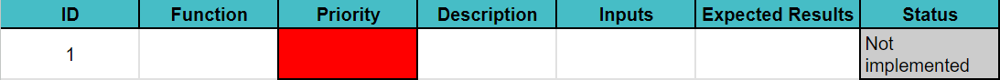
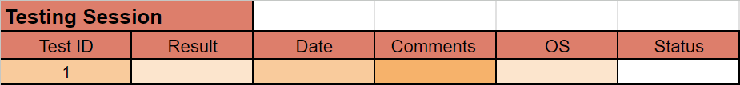

# Tinder-like reqruitment app - Test Plan

 Table of Contents 

- [Tinder-like reqruitment app - Test Plan](#Tinder-like-reqruitment-app---Test-Plan)
    - [Product Analysis](#1-product-analysis)
        - [Overview](#12-overview)
    - [Strategy](#2-strategy)
        - [Scope of testing](#21-scope-of-testing)
            - [In-scope testing](#211-in-scope-testing)
            - [Out of scope testing](#212-out-of-scope-testing)
        - [First steps](#22-first-steps)
        - [Testing sessions](#23-testing-sessions)
        - [Automation testing](#24-automation-testing)
        - [Monitoring and tools](#25-monitoring-and-tools)
            - [Github](#251-github)
            - [Github issues](#252-github-issues)
                - [Spreadsheet structure](#2521-spreadsheet-structure)
                - [Use of templates](#2522-use-of-templates)
    - [Test Criteria](#3-test-criteria)
        - [App Evaluation](#31-app-evaluation)
        - [Suspension Criteria](#32-suspension-criteria)
        - [Exit Criteria](#33-exit-criteria)
        - [Test cases](#34-test-cases)
    - [Test Schedules/Estimations](#4test-schedulestimations)
    - [Glossary](#5-glossary)

---

 
## 1 Product Analysis

### 1.2 Overview

The project aims to create a "Tinder style" recruitment application that 
matches companies with jobseekers using the Flutter software, which will 
be functional on android, desktop and tablets.

The app will ensure the anonymization of the user and will focus on the
soft skills, instead of solely on diplomas and proffesional experience.
There will be a "matching" proccess that will occur between the user and the 
company, which then the company will be able to contact the user via email. We will illustrate the operational flow of the software and provide a visual representation through a diagram. For further details, refer to the [functional specifications](https://github.com/algosup/2023-2024-project-5-flutter-team-8/blob/main/documents/functional_specification/functional_specification.md) document.

## 2. Strategy

Due to the fact that the project needs to be completed in a short time period, we will be implementing a regression testing proccess in order for us to be able to catch bugs while we are in developement of the app. 

### 2.1 Scope of testing

Testing will focus on ensuring the functionality of the application, that is, primarily focusing on the front end. The back end will be simulated as it it not required.

#### 2.1.1 In-scope testing 

- Code
    - Absence of significant bugs
    - Most important aspecs of the app functionality 
    - Acceptable visual quality 
- Documents
    - Spelling accuracy 
    - Coherent sentencing
    - Typographical errors

#### 2.1.2 Out of scope testing

- Backend testing 
- Full functionality of the app 

### 2.2 First steps

The first step is to identify the impact and risk of the latest code change.That can be achieved by performing conduct code review sessions by leveraging a version control system such as git to compare the differences between the old and new code. After that, the QA lead will decide which changes should be extensively tested and which could bare with adequate testing. The determining factor will be the impact of the core features that will be affected the most. 

### 2.3 Testing Sessions 

Testing sessions will include widget testing. Widget testing in Flutter allows you to verify the behavior and appearance of individual widgets in isolation, ensuring that they render correctly and respond to user interactions as expected. This type of testing can be more specific than unit testing and less broad than integration testing.

### 2.4 Automation testing 

Automation testing is a type of testing which uses specialized tools and software to execute predefined test cases automatically.This will be key to our testing proccess considering the time constraint and the fact that manual testing takes a long time and is less effective due to human error. However manual testing will be implemented if neccessary.

### 2.5 Monitoring and tools

#### 2.5.1 Github

GitHub serves as our central platform for version control, collaboration, and issue tracking, fortunately GitHub also provides a CI/CD tool(Continuous Integration/Continuous Deployment) called GitHub Actions, this tool allows us to run tests automatically after various actions on the repository and avoid errors on the dev or main branch on each push.

We will also use GitHub Issues to report bugs and errors, it will allow us to make available to the development team a list of bugs and errors to be corrected, and to have a better overview of the progress of the project.

#### 2.5.2. GitHub Issues
GitHub Issues is a built-in issue-tracking tool that allows us to create and manage issues and assign them to team members.

We define:

 - Bugs: Unexpected problems or code errors.
 - Errors: Includes all errors that do not originate in the code.
 - Deadlines: Specific deadlines for project stages to ensure timely delivery.
 - Documentation: Request for documentation on a specific function or group of functions in the code.
 -Task allocation: Assignment and tracking of specific responsibilities.

GitHub Issues Strategy:

We are implementing a strategy for managing GitHub issues. Here are the key components of our strategy:

 1. Detailed Issue Descriptions:

    - Issues should have clear and detailed descriptions to provide context and understanding.
    - Include steps to reproduce bugs or details about the feature request.
    - Specify the expected and actual behavior.
 2. Assignees and Responsibility:

    - Assign issues to the appropriate team member or individuals responsible for addressing the problem.
    - Assignees take ownership of the task, improving accountability.
  3. Use of Templates:

##### 2.5.2.1 Spreadsheet Structure
1. Test Case Pattern:
- ID: Unique identifier for each test case.  
- Name: The function or feature being tested.
- Priority: The priority level of the test case (High 🟥, Medium 🟧, Low 🟨).
- Test Description: A concise description of the test case.
- Steps: Input values or conditions applied during testing.
- Expected Result: The expected outcome or behavior.
- Status: The current status of the test case (Passed, Failed, In - Progress, Not Implemented).

2. Test reports

- For each test case, there is a dedicated section to record results obtained during testing sessions.
- Testers can input whether the test passed, failed, is in progress, or not implemented during a specific testing session.
- The date of the testing session is also recorded.

##### 2.5.2.2 Use of Templates

We have introduced issue templates to standardize the information provided for different types of issues.
- The "software_bug_report" template, streamlines the bug reporting process with predefined sections.The template includes sections for steps to reproduce, expected and actual behavior, environment details, and more.
Using this template ensures that crucial information is consistently captured for debugging and resolution.
- The "feature_request" template, gives a platform to express any creative ideas someone might have come up with, that they want to bring to the team.
- The "documentation_report" template is used if any errors are discovered in any of our documentations throughout our work proccess or if there are missing documentations that should be implemented in the future. 
- The "pull_request_template" is created to ensure that changes that are created to written code or documents, is properly documented and approved by other team members. 

## 3. Test Criteria

Establishing test criteria is crucial to guarantee the quality of our program before it is released. This represents some standards to which our application must conform to before being sent to customers.

### 3.1 App evaluation

Here will be presented the most important assessments on how to evaluate the app:

1. Interface Intuitiveness - The interface should work as expected by the user with no significant errors or overly complex commands that would sway the usage of the app.

2. App performance - The speed at which pages load and tasks will be executed will be at an acceptable rate.

3. App security - The app should be secure and non breachable by any third party, information about the user will remain unknown to anyone unless agreed by the user.

4. App relevance to company needs - The app will be constructed as per it has been described by the company We Are Evolution.

### 3.2 Suspension Criteria

Suspencion criteria are established to define conditions under which testing activities are temporarily halted.Such conditions are:

1. Critical Bug Threshold - If a critical bug is encountered to which the app becomes non-functional,
    a temporary suspension is put in place on testing and implementation until the bug has been resolved.

2. Recource/Environment issues - If for whatever reason there is an issue with the software or environment 
that is to be utilized, the testing will be suspended until the issues have been resolved.

### 3.3 Exit Criteria 

Before the app can be considered finished, certain milestones need to have been met by the team.
This criteria ensures that the app meets the required quality standards before reaching the consumer.

1. Test Case Coverage - A minimum test case coverage of 80% of all the added features and functionalities must be completed with success.

2. Bug Resolution Coverage - At least 90% of bugs must be addressed and resolved before the app is considered finished.

3. Documentation Completeness - Comprehensive documentation, including test plans, test cases, test results, functional specifications, and technical specifications, must be finalized and reviewed for completeness. Documentation should be easily understandable and accessible to all team members, ensuring a clear understanding of the testing process and results.

### 3.4 Test cases

The test cases is a list that catalogs of tests that will be performed by priority. You can find them in the "quality_assurance" document on github or by simply clicking [here](https://github.com/algosup/2023-2024-project-5-flutter-team-8/blob/main/documents/quality_assurance/test_cases.md).

## 4.Test Schedules/Estimations

| Task | Start Date | End Date | Duration |
| ---- | ---------- | -------- | -------- |
| 01 | 06/06/2024 | 06/06/2024 | 3h30m |
| 02 | 07/06/2024 | 07/06/2024 | 3h30m |
| 03 | 10/06/2024 | 10/06/2024 | 3h30m |

## 5. Glossary

| Term | Definition | Source |
| ---- | ---------- | ------ |
| **Automation Testing** | Automation testing is the process of automating the execution of test cases through scripts and/or specialized tools. | [Wikipedia](https://en.wikipedia.org/wiki/Test_automation)
| **Dart** | Dart is a programming language optimized for cross-platform applications. It is developed by Google and is used to create mobile, desktop, server and web applications.| [Wikipedia](https://en.wikipedia.org/wiki/Dart_(programming_language))
| **Flutter Software**| Flutter is an open-source UI software development kit created by Google. It can be used to develop cross platform applications from a single codebase for the web, Fuchsia, Android, iOS, Linux, macOS, and Windows. | [Wikipedia](https://en.wikipedia.org/wiki/Flutter_(software))
| **Git** | Git is a distributed version control system that tracks versions of files. It is often used to control source code by programmers collaboratively developing software. | [Wikipedia](https://en.wikipedia.org/wiki/Git)
| **Regression Testing** | Regression testing is re-running functional and non-functional tests to ensure that previously developed and tested software still performs as expected after a change.   | [Wikipedia](https://en.wikipedia.org/wiki/Regression_testing)    
|**Visual Studio Code** | Visual Studio Code is an extensible code editor developed by Microsoft for Windows , Linux and macOS. | [Wikipedia](https://fr.wikipedia.org/wiki/Visual_Studio_Code)

| Created on | Last Update | 
| ---------- | ---------- |
| 17/05/2024 | 07/06/2024 |