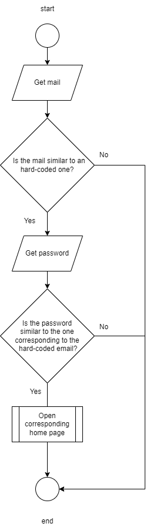
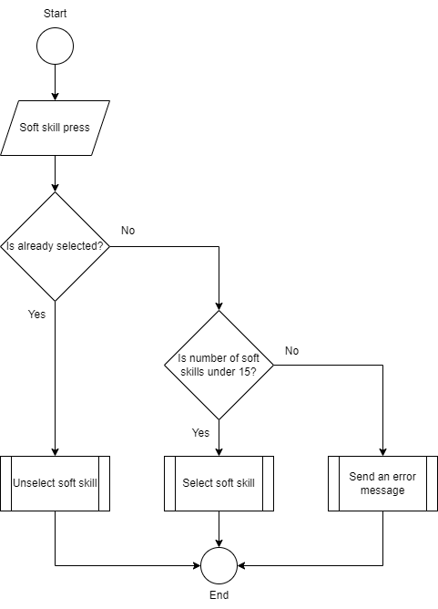
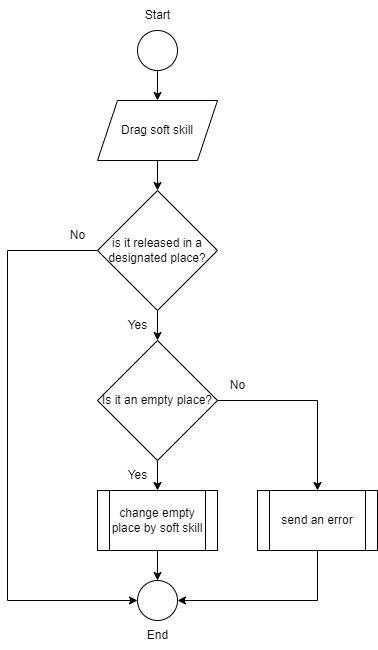
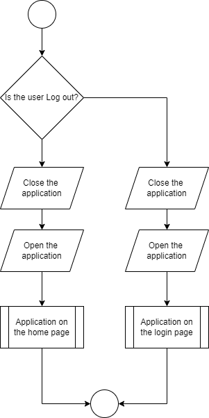
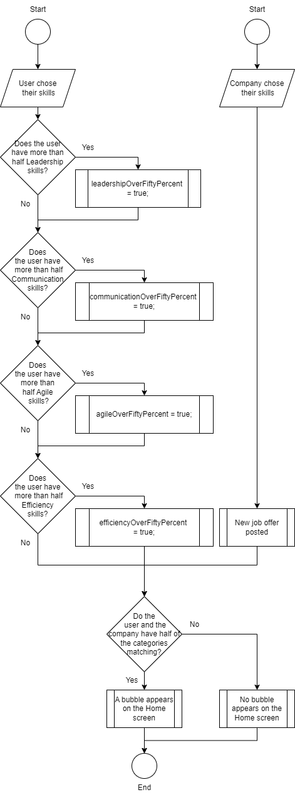
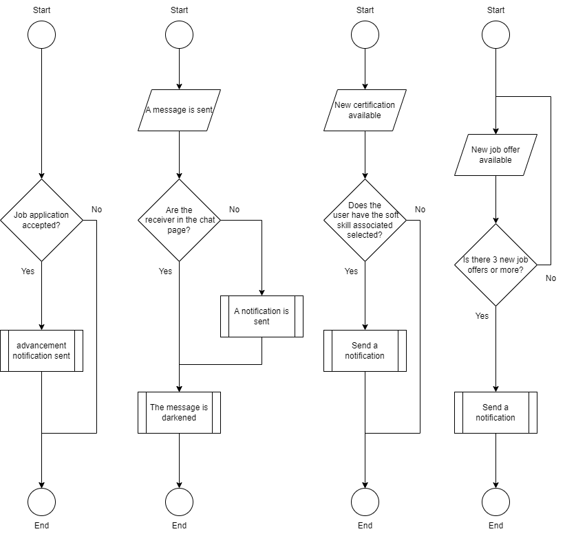

<br />
<div align="center">
  <h1 align="center">Technical Specification</h1>
  <p align="center">
    <strong>Adopte 1 Candidat</strong>
    <br />
  
  </p>
</div>

<details>
<summary>

## Table of content </summary>

- [Table of content ](#table-of-content-)
- [I. Introduction](#i-introduction)
  - [1. Purpose](#1-purpose)
  - [2. Scope](#2-scope)
- [II. Conventions](#ii-conventions)
  - [1. Coding Standards](#1-coding-standards)
  - [2. Naming Conventions](#2-naming-conventions)
  - [3. Commenting and Documentation](#3-commenting-and-documentation)
- [III. System Overview](#iii-system-overview)
  - [1. System Architecture](#1-system-architecture)
  - [2. Technology Stack](#2-technology-stack)
- [IV. Application Architecture](#iv-application-architecture)
  - [1. State Management](#1-state-management)
  - [2. Navigation](#2-navigation)
- [V. Data Management](#v-data-management)
  - [1. Data Models](#1-data-models)
  - [2. Local Storage](#2-local-storage)
- [VI. Functional Requirements](#vi-functional-requirements)
  - [1. User Authentication](#1-user-authentication)
  - [2. User Profile Management](#2-user-profile-management)
    - [2.1. Personal Information](#21-personal-information)
    - [2.2. Skills](#22-skills)
    - [2.3. Certifications](#23-certifications)
    - [2.4. Notifications](#24-notifications)
    - [2.5. Jobs Liked](#25-jobs-liked)
    - [2.6. Logout](#26-logout)
  - [3. Job Offer Matching](#3-job-offer-matching)
  - [4. Swiping Interface](#4-swiping-interface)
  - [5. Notifications](#5-notifications)
- [VII. User Interface Design](#vii-user-interface-design)
  - [1. UI Components](#1-ui-components)
  - [2. Themes and Styles](#2-themes-and-styles)
- [VIII. Integration and Deployment](#viii-integration-and-deployment)
  - [1. Continuous Integration](#1-continuous-integration)
  - [2. Deployment Strategy](#2-deployment-strategy)
    - [2.1. App Store](#21-app-store)
    - [2.2. Google Play Store](#22-google-play-store)
  - [3. Environment Configuration](#3-environment-configuration)
    - [3.1. VSCode Installation](#31-vscode-installation)
    - [3.2. Flutter Installation](#32-flutter-installation)
    - [3.3. Riverpod Installation](#33-riverpod-installation)
    - [3.4. Freezed Installation](#34-freezed-installation)
    - [3.5. Go\_router Installation](#35-go_router-installation)
- [IX. Maintenance and Support](#ix-maintenance-and-support)
  - [1. Logging and Monitoring](#1-logging-and-monitoring)
  - [2. Bug Reporting and Tracking](#2-bug-reporting-and-tracking)
  - [3. Updates and Upgrades](#3-updates-and-upgrades)
- [X.  Appendices](#x--appendices)
  - [1. Glossary](#1-glossary)
  - [2. References](#2-references)

</details>

## I. Introduction

### 1. Purpose


This document is meant to explain how to create the application by implementing the features detailed in the [functional specification](https://github.com/algosup/2023-2024-project-5-flutter-team-8/blob/main/documents/functional_specification/functional_specification.md).
The purpose of the application is to create a new way of recruiting people based on their soft skills and not their technical skills. It is also totally anonymized for better equality between the potential candidates.

### 2. Scope


This project should be done using Flutter and be compatible with all types of devices.

This implementation should be only targeting the front-end at first and should offer an interface to candidates, and companies but also "We are evolution." as an administrator.

## II. Conventions

### 1. Coding Standards


This project is entirely made in the Flutter dart language, that's why it is logical and easy to keep the same coding convention as the Flutter.

Classes, enum types, typedefs, and type parameters should be in PascalCase:
```Dart
class ClassName { ... }

enum EnumName { ... }

typedef Predicate<T> = bool Function(T value);
```

Extensions have the same naming convention as Classes which is PascalCase:
```Dart
extension MyExtensionList<T> on List<T> { ... }
```

Packages, Files and Folders should be named in a snake_case style:
```
my_package
└─ lib
   └─ file_system.dart
   └─ slider_menu.dart
```

The name import prefixes should also be in a snake_case style:
```Dart
import 'dart:math' as math;
import 'package:angular_components/angular_components.dart' as angular_components;
import 'package:js/js.dart' as js;
```

Other identifiers such as Class members, top-level definitions, variables, parameters, and named parameters would be in a simple camelCase:

```Dart
var number = 3;

HttpRequest httpRequest;

void align(bool clearItems) {
  // ...
}
```

Prefer camelCase for constants or SCREAMING_CAPS if it was already used in the code source:
```Dart
const pi = 3.14;
```

Avoid using '_' before identifiers that are not private.\
Also, avoid prefix letters. \
Moreover, do not explicitly name libraries, Dart generates a unique tag for each library based on its path and filename.

The Flutter language is a prioritization in his import files, they should follow this order alphabetically:
- `dart:` imports
- `package:` imports
- relative imports
- exports

```Dart
import 'dart:async';
import 'dart:html';

import 'package:bar/bar.dart';
import 'package:foo/foo.dart';

import 'util.dart';

export 'src/error.dart';
```

Format comments like sentences for better understanding:
```Dart
// This comment explains ...
```
Avoid using block comments for documentation.

### 2. Naming Conventions


This project has two main naming conventions, which are the repository naming convention and the coding naming convention.

Some of the coding naming conventions were defined above in the previous section. Here are the missing ones:
```
path: kebab-case
function: camelCase
class: PascalCase
widget: PascalCase
```
The repository naming conventions are the following:
```
branches: kebab-case
folder: snake_case
file: snake_case
```
Moreover, all the branches have been defined previously.
|Names|Utilities|
|-----|---------|
|main |owning the final state of the project|
|documents|all the modifications related to the document, whatever it is, should be done on this branch|
|dev  |owning the most complete and functional version of the code|
|*code feature*|owning one specific function of the specific code, should be erased once merged to the dev branch|

The branches should be merged following a simple pull request system.
The lower branch should merge with the higher branch to avoid conflict. If there is none or when they are corrected, a pull request should be done to merge the lower branch to the higher one.
The hierarchy would follow this tree:
```
main
-> documents
-> dev
  -> One branch for each big feature
```

### 3. Commenting and Documentation


As said in section [1. Coding Standards](#1-coding-standards), the code should be commented on with single-line commentary and with clear sentences. \
It is recommended to be explicit and to use the most possible commentaries to inform potential software engineers of the use of each function.

## III. System Overview

### 1. System Architecture


Our GitHub repository will be created following the architecture hereunder:

```
Root
│   .gitignore
│   CODE_OF_CONDUCT.md
│   LICENSE
│   README.md
│
├───.github
│       documentation_report.yml
│       feature_request.yml
│       pull_request.yml
│       software_bug_report.yml
│
├───documents
│   ├───functional_specification
│   │   │   adopte_1_candidat_mockup.pdf
│   │   │   functional_specification.md
│   │   │
│   │   └───img
|   |       |
│   │       └───app_img
│   │
│   ├───management
│   │   │   management_artifacts.md
│   │   │   project_charter.md
│   │   │
│   │   ├───pictures
│   │   │
│   │   └───weekly_reports
│   │           cumulative.md
│   │           week1.md
│   │           week2.md
│   │           week3.md
│   │           week4.md
│   │           week5.md
│   │           week6.md
│   │
│   ├───quality_assurance
│   │       test_cases.md
│   │       test_plan.md
│   │
│   └───technical_specification
│       │   technical_specification.md
│       │
│       └───img
│
└───src
    │   .gitignore
    │   .metadata
    │   analysis_options.yaml
    │   pubspec.lock
    │   pubspec.yaml
    │   README.md
    │
    ├───android
    │
    ├───assets
    │
    ├───ios
    │
    ├───lib
    │   │   constants.dart
    │   │   database.dart
    │   │   loading.dart
    │   │   main.dart
    │   │   routes.dart
    │   │   splash_screen.dart
    │   │
    │   ├───login
    │   │       checkbox.dart
    │   │       login.dart
    │   │
    │   ├───redundancy
    │   │       rectangle_button.dart
    │   │       round_button.dart
    │   │       text_fields.dart
    │   │
    │   └───signup
    │           signup.dart
    │
    ├───linux
    │
    ├───macos
    │
    ├───test
    │       widget_test.dart
    │
    ├───web
    │
    └───windows
```
The architecture of the application will be in the src/lib folder, containing all the pages of both the candidate and company sides.

### 2. Technology Stack


For this project, it has been decided to use the Flutter/Dart language as well as some famous extensions of it, which are:
- [riverpod](https://riverpod.dev/): which is a reactive caching framework for Flutter/Dart. Using declarative and reactive programming, Riverpod takes care of a large part of your application's logic for you.
- [freezed](https://pub.dev/packages/freezed): a code generator for data-classes/unions/pattern-matching/cloning.
- [go_router](https://pub.dev/packages/go_router): a declarative routing package for Flutter that uses the Router API to provide a convenient, url-based API for navigating between different screens. You can define URL patterns, navigate using a URL, handle deep links, and a number of other navigation-related scenarios.

The Project would be held on GitHub for better development and sharing in the project team. \The IDE IDE used for this project would be VSCode.
To simulate the back-end, it is recommended to use [PocketBase](https://pocketbase.io/).

## IV. Application Architecture

### 1. State Management


To manage the state of the application, Riverpod will be used. It is a dependency allowing the development team to manage the state way more easily. The development team will principally use the ``Notifier`` and ``Provider`` to change the state of the application easily.
To help the development team, it is recommended to install the VSCode extension named ``Flutter Riverpod Snippets`` to get snippets.
Example of Provider and Notifier:
```Dart
class AuthNotifier extends StateNotifier<AuthState> {

  AuthNotifier()
  : super(
    AuthState(isAuthenticated: false, error: null),
  );
}

final authProvider = StateNotifierProvider<AuthNotifier, AuthState>(
  (ref) => AuthNotifier(),
);
```

### 2. Navigation


For the navigation between the different pages, go_routeur will be used. It is a simpler way to navigate between the pages than the one provided by default.
Here is what it would look like:
```Dart
GoRouter goRouter() {
  return GoRouter(
    initialLocation: '/loading',
    routes: <RouteBase>[
      GoRoute(
        path: '/loading',
        name: 'loading',
        builder: (context, state) => const Loading(),
      ),
      GoRoute(
        path: '/splashScreen',
        name: 'splashScreen',
        builder: (context, state) => const SplashScreen(),
      ),
    ],
  );
}
```
This is only a simple preview for the first two pages, all the pages would be defined hereunder:
| Names | Path | Descriptions |
| ----- | ---- | ------------ |
| 'logo' | '/logo' | loading screen |
| 'splashScreen' | '/splashScreen' | Description of the application|
| 'login' | '/login' | login with a password and a mail account|
| 'forgetPassword' | '/forgetPassword' |ask for a new password via the mail|
| 'typeUserChoice' | '/typeUserChoice' |chose if you are a company or a candidate|
| 'signUpUser' | '/signUpUser' | ask for the full name, the mail and the password of the user |
| 'softSkillsChoices' | '/softSkillsChoices' | a page with 40 skills predifined |
| 'softSkillsRank' | '/softSkillsRank' | page to rank the previously selected skills |
| 'location' | '/location' | page to put the address and the range around it |
| 'profilePicture' | '/profilePicture' | page to define user's profile picture|
| 'checkYourEmail' | '/checkYourEmail' | waiting screen for the mail to be checked|
| 'successfully' | '/successfully' | page when succesfully checked |
| 'homeScreen' | '/homeScreen' |main page with the job offer on bubble form |
| 'jobInfo' | '/jobInfo' | page when a bubble is clicked to have more information about the job|
| 'skillsCategories' | '/skillsCategories' | page where all the big certification categories are displayed |
| 'skillsSelection' | '/skillsSelection' | page where the certification are shown |
| 'message' | '/message' | page where all the chats are listed |
| 'chat' | '/chat' | specific chat with one company|
| 'noMessage' | '/noMessage' | page displayed when no messages|
| 'profile' | '/profile' | page to acces to the diverse settings |
| 'personalInformation' | '/personalInformation' | page displaying user's full name, mail, password and location |
| 'updatePassword' | '/updatePassword' |page to change the password |
| 'updateProfilePicture' | '/updateProfilePicture' | page tochange of profle picture|
| 'settings' | '/settings' | containing all the different kinds of notifications |
| 'jobs-liked' | '/jobs-liked' | containing a list of the jobs liked |
| 'profile-certification' | '/profile-certification' | the page to see the list of certification got |
| 'profile-skills' | '/profile-skills' | skills selected when registered |
| 'profile-add-skills' | '/profile-add-skills' | to add more or change the skills selected |
| 'profile-rank-skills' | '/profile-rank-skills' |to rank the skills selected |
| 'sign-up-company' | '/sign-up-company' | ask for company's name and registration number as well as responsible's mail and password|
| 'profile-picture-company' | '/profile-picture-company' | select a logo for the company |
| 'company-home-screen' | '/company-home-screen' | page where all the company's job offer are |
| 'no-offer' | '/no-offer' | page displayed when no job offer proposed |
| 'add-job-offer' | '/add-job-offer' | ask for the needed informaion (see the functional specification)|
| 'add-images' | '/add-images' | 6 slots to import images |
| 'add-soft-skills-job' | '/add-soft-skills-job' | select the soft skills needed for the job offer |
| 'skills-categories-company' | '/skills-categories-company' | big categorie for the certifications |
| 'skills-selection-company' | '/skills-selection-company' | list of the different certification created by the company on a specific category |
| 'message-qualified-company' | '/message-qualified-company' | chat list where the candidate met the prerequisites |
| 'message-unqualified-company' | '/message-unqualified-company' | chat list where the candidate don't met the prerequisites |
| 'profile-company' | '/profile-company' | where the profile is displayed |

## V. Data Management

### 1. Data Models


This application will need data management when it would be released, to help this management and the development team, these data would be stored in classes as templates.
The job offer class would look like this:
```Dart
class JobOffer {
  String logo;
  String companyName;
  String nameOfTheJob;
  String startDate;
  String endDate;
  String contractType; 
  String location, 
  String jobDescription

  JobOffer({required this.logo, required this.companyName, required this.nameOfTheJob, required this.startDate, required this.endDate, required this.contractType, required this.location, required this.jobDescription});
}
```
The User class like that:
```Dart
class User {
  String fullName;
  String email;
  String password;
  int range;
  String address;
  String avatar;

  User({required this.fullName, required this.email, required this.password, required this.range, required this.address, required this.avatar});
}
```
The company class will be a bit similar to the User class:
```Dart
class Company {
  String companyName;
  String companyRegistrationNumber;
  String email;
  String password;
  String logo;

  User({required this.companyName, required this.companyRegistrationNumber, required this.email, required this.password, required this.logo});
}
```
And finally, the soft skills class should look this way:
```Dart
class SoftSkills {
  String name;
  String categories;
  bool selected;

  SoftSkills({required this.name, required this.categories, required this.selected});
}
```

### 2. Local Storage


The local storage would be done on the device memory since there is no real backend asked for the project. However, it could be simulated with an open-source backend consisting of embedded database named pocketbase. \
This Storage would allow the development team to simulate a User on both the candidate and company sides. It would also help the Quality Assurance team to do tests, such as the account creation.

## VI. Functional Requirements

### 1. User Authentication


For the user authentication, only the front end is asked. Two profiles would then be set beforehand, one for the company and one for the user. \
To see if the authentication is done the text put in the box should be the same as the predefined earlier in both the mailbox and the passwordbox. \
For this, a ``Textfield`` and a controller would be used for simpler usage. \
The mail ``Textfield`` will be checked first to know which password is the right one, if the authentification is passed the password ``Textfield`` is checked, if the password is correct it will change the page to the main page of the company or the user according to the one who registered. \
There is a diagram to understand it better:



The code in the router file would have a builder like this:
```Dart
builder: (context, state) {
  if (authService.isAuthenticated == true){
    return const Settings();
  }
  return const LoginScreen();
}
```
The authentification class should be expressed this way:
```Dart
class AuthService {
  bool isAuthenticated = false;

  login (String code){
      isAuthenticated = (code == '1234');
      return isAuthenticated;
  }

  logout (){
    isAuthenticated = false;
  }
}
final AuthService authService = AuthService();
```
Finally, ``TextField``s would be similar to this example (``obscureText`` only for the password):
```Dart
_passwordController.value;

TextField(
    controller: _passwordController,
    decoration: const InputDecoration(labelText: 'Password'),
    obscureText: true,
  ),
```

### 2. User Profile Management


To access the User Profile you should click on the bottom right icon in the ``bottomBar`` provided by Flutter.
When on the User Profile Page the icon changes to a black version of the same icon, implying you are on the right page.

|Names|Visuals|
|-----|-------|
|Profile Logo||
|Profile Logo Black||

It would look like this:
```Dart
Scaffold(
  bottomNavigationBar: BottomNavigationBar(
    items: const <BottomNavigationBarItem>[
      BottomNavigationBarItem(
        icon: Icon(Icons.home),
        label: 'Home',
      ),
      BottomNavigationBarItem(
        icon: Icon(Icons.business),
        label: 'Business',
      ),
      BottomNavigationBarItem(
        icon: Icon(Icons.school),
        label: 'School',
      ),
    ],
    currentIndex: _selectedIndex,
    selectedItemColor: Colors.amber[800],
    onTap: _onItemTapped,
  ),
);
```
When on the page, six buttons will be displayed to access respectively:
- Personal Information
- Skills
- Certifications
- Notifications
- Jobs liked
- Logout
 
When pressed, it would redirect to the corresponding page.
To get back to the Profile Page, the left arrow on the AppBar should be clicked.

#### 2.1. Personal Information

This page would be composed of many ``TextField`` Boxes containing the Full name, the password, the e-mail and the Location.
Under them should be displayed a sliding range bar to express the radius around the location to find a job.

In the password's ``TextField`` there should be a right arrow in the right of the box.
When clicked, a new page should open. This page would be used to update/change the password. For this, the page would contain three others ``TextField`` for the old password, the new password, and the confirmation of the new password. All of these three boxes should have ``obscureText`` set as true inside.
A button would be displayed at the bottom of the page to update the password when pressed.

For this bar, the Widget used will be ``Slider`` here is an example of how to use it:
```Dart
class SliderExample extends StatefulWidget {
  const SliderExample({super.key});

  @override
  State<SliderExample> createState() => _SliderExampleState();
}

class _SliderExampleState extends State<SliderExample> {
  double _currentSliderValue = 20;

  @override
  Widget build(BuildContext context) {
    return Scaffold(
      body: Slider(
        value: _currentSliderValue,
        max: 100,
        label: _currentSliderValue.round().toString(),
        onChanged: (double value) {
          setState(() {
            _currentSliderValue = value;
          });
        },
      ),
    );
  }
}
```

At the bottom of the page, a saving button would be displayed to keep the new information, if the user leaves the page without saving, the information wouldn't be saved.

#### 2.2. Skills

This page would display all the soft skills pre-selected by the user during its registration. All of them would be put inside ``SizedBox`` containing the name of the soft skill and a little cross, if the user wants to remove this soft skill.
Moreover, at the bottom of the page will be another button to change the soft skills selection.
When pressed, it would redirect to another page (profile-add-skills).

On this page, the soft skills would appear under the form of tags, boldened when selected. If the user clicks on one it would change the weight to selected or unselected depending on the initial state. However, it could not overpass 15 soft skills selected at once.
To do the shading we will use:
```Dart
final notifier = ref.read(tagsProvider.notifier);

fontWeight: notifier.isSelected(tag) ? FontWeight.bold : FontWeight.normal,

bool isSelected(Tag tag){
    return state.selectedTags.contains(tag);
  }
```
And for the overpass:
```Dart
GestureDetector(
  onTap: () {
    notifier.toggleTag(tag);
  },
),

void toggleTag(Tag tag) {
  if (isSelected(tag)){
    _deselectTag(tag);
  } else if (tag.number < 15){
    _selectTag(tag);
  }
}
```
It would follow this logic:


The ranking part would be done on another page only for this. It would be composed of three columns in a row.
The first one would be dedicated to the ranking by numbering them from one to fifteen.
The second one would be composed of ``DragTarget`` Elements. They would host the elements from the third column.
```Dart
// ElevatedButton are here for the example and not relevant of the actual code
DragTarget<ElevatedButton>(
  onAcceptWithDetails: (details) {
    ElevatedButton(onPressed: () {       
    }, 
    child: Text(string)
    );
  },
  builder: (
    BuildContext context,
    List<dynamic> accepted,
    List<dynamic> rejected,
  ) {
  return Container(
    child: ElevatedButton(
      onPressed: () {                 
      }, 
      child: Text(accepted.isEmpty ? string = "NoData" : string = "Data")
      ),
    );
  },
),
```
The third column would be composed of ``Draggable`` Elements to move them from their original place to the expected ranking place.
```Dart
// ElevatedButton are here for the example and not relevant of the actual code
Draggable(
  feedback: ElevatedButton(
    onPressed: () {         
    }, 
    child: const Text('data')
  ),
  childWhenDragging: ElevatedButton(
    onPressed: () {
    },
    child: const Text('data')
  ),
  child: ElevatedButton(
    onPressed: () {
    }, 
    child: const Text('data')
  ),
),
```
When a ``Draggable`` Element is held it should appear under the mouse/finger and follow it with an opacity of 0.5.
If it is released on top of an empty ``DragTarget`` then it would take the place of it.
Else if the ``DragTarget`` is not empty, an error message should be sent in the scaffold.



#### 2.3. Certifications

The certification page would contain The big categories of certification which would be:
- Leadership
- Efficiency
- Social competences
- Agile competences
Each of them would be a ``container`` with round borders, an image in the center of it and a name under it.

The images for the big certification would be:
|Names|Pictures|
|-----|--------|
|Leadership||
|Efficiency||
|Social competences||
|Agile competences||

When clicked, it would open the corresponding page with the certification corresponding to it. It would be a ``List<Certification>`` named certifications.

For this List of elements, a Provider would be needed to change the different states of the List and then always have it shown. This Provider would be used with the dependencies of Riverpod, using a ``StateNotifierProvider``.

There, all the certifications would be clickable to see a better definition, passage procedures and what the certification would be.

#### 2.4. Notifications

The notification page would be a list of six ``sizedBox``s with ``BorderRadius``. They would contain each, the name of the notification (see [Functional Specification](https://github.com/algosup/2023-2024-project-5-flutter-team-8/blob/main/documents/functional_specification/functional_specification.md)) and a switch to disable them if wanted (All the notifications would be set as true at the beginning).
The only one that would differ would be the first one, it would contain a leading bell icon, the name would be Notifications, and also a switch. This one particularly would disable all of the Notifications in one click.
Here is an example of a switch:
```Dart
Switch(
  value: light,
  overlayColor: overlayColor,
  trackColor: trackColor,
  thumbColor: const MaterialStatePropertyAll<Color>(Colors.black),
  onChanged: (bool value) {
    setState(() {
      light = value;
    });
  },
);
```
At the bottom of the page would be an ``ElevatedButton`` to save the changes made during the time the page is open. However, if the page is closed or returned to a previous one whereas the button is not clicked, the changes would not be taken into account and the previous settings would be set as the previous one.

#### 2.5. Jobs Liked

To keep a touch on the job you applied for, a page dedicated to them is joinable from the account profile. It would be a ``List``. The number of the list's elements should be incremented each time a job offer is applied. The class for it would be designed like this:

```Dart
class JobsLiked {
  String logo;
  String nameOfTheJob;
  String date;

  JobOffer({this.logo, required this.nameOfTheJob, required this.date});
}
```

#### 2.6. Logout

Once the application is not needed anymore, or to close the account, a logout button is available in the profile user account. It is a simple `ElevatedButton` that leads to the login page when clicked. It should close all the pages of the application open and you could not go back to the page before with the arrow of your smartphone. To get access to the application again, the login should be done once more. If you close the application and open it again, it will not send you to the login page if you did not log out before leaving the application.



### 3. Job Offer Matching


To have a job offer on the home page screen, it should have a match of over 50% of the soft skills selected by the company and by the user.
To make things easier to understand. 
Companies would have to choose which of the four categories they judge useful for the job offer.
The user has to select 15 skills at the registration. These skills belong to bigger categories of soft skills (more defined in [2.3. Certifications](#23-certifications)). If in these 15 skills, more than half of the categories are selected, the category is assumed as acquired.
Finally, if the user has more than half the categories asked by the company, he would see the bubble, corresponding to the said job offer.
Here is a diagram for better comprehension:



### 4. Swiping Interface


Once on the Home screen, the job offer matching is done. It should appear some bubbles on the screen, depending on the job offers you might apply. The bubbles are designed with a circle around the company's logo.
When a bubble is clicked. A pop-up appears on the screen, containing the logo, description of the job, and date for the upper part, whereas, in the bottom part, two buttons would be displayed, one to deny the match, and another to accept it.
Here are the visuals:
|Names|Logos|
|-----|-----|
|Deny ||
|Apply||

For this pattern, the Widget use would be ``Dialog``.
Moreover, when the user has the pop-up, the possibility to swipe to complementary options is available. By swiping he could see more images from his potential workplace.
To swipe, the Widget used would be ``Draggable``.
Finally, if the user denies the job offer, the bubble would just disappear, in the other case, the match would be sent to the [jobs liked section](#25-jobs-liked) on the profile page.

### 5. Notifications

<!-- Detail how notifications are handled within the application (e.g., local notifications). -->
The notifications would be pop-up bars, appearing on the top of the screen. There are many types of them that you can see in the [functional specification](https://github.com/algosup/2023-2024-project-5-flutter-team-8/blob/main/documents/functional_specification/functional_specification.md).
To create this, another package would be needed, it is called ``flutter_local_notifications``.

It could be installed by entering these command lines in the VSCode terminal, at the root of your project:
```terminal
flutter pub add flutter_local_notifications
```
Once it is installed you can check for major versions by following the same steps as for Riverpod (outdated, upgrade, get).

If you want a more complete page dedicated to Go_router's installation, [here](https://pub.dev/packages/flutter_local_notifications/install) is the website page for it.

The notification settings could be modified in the Profil Parameter, which refers to [2.4 Notifications](#24-notifications) for more information.

If a company sends a positive answer to a job application, the user should get a notification to inform it of the advancement of his proposition. To keep a hand on the advancement, a notification would also be sent every time a new message is received, except if the user is already on the chat page, in that case, only the message would darken, to inform the user a new message isn't read.
The two last notifications a user could receive are the certification and job offer ones.
For the certification, the user would receive a notification in case the certification is needed for his skills. For example, if a new certification is available for a soft skill not selected by the user, he would not be informed. However, if the certification is about one of their soft skills, a notification would be sent as a pop-up bar.
Finally, for every three new job offers, a certification would be sent to the user. Like this, they could be informed without being harrassed by notifications.



## VII. User Interface Design

### 1. UI Components


The UI components are used to simplify the development team's work by reducing the time of the design creation and focusing more on the algorithm part of the application. To do so, a lot of the icons predefined in the mock-up will be used as images and not created by hand by the development team.
Moreover, the mock-up is the first version of the application and the ideal view we want it to be, it could, however, be changed during the creation phase, since the time to do the mock-up was short and if new ideas come to mind afterward, they could be added to the last version of the application.
To see the mock-up or a better definition of the UI designed by the program manager, here are the links for:
- [The Functional Specification](https://github.com/algosup/2023-2024-project-5-flutter-team-8/blob/main/documents/functional_specification/functional_specification.md)
- [The Application Mock-up](https://github.com/algosup/2023-2024-project-5-flutter-team-8/blob/main/documents/functional_specification/adopte_1_candidat_mockup.pdf)

### 2. Themes and Styles


The application would only have the light mode at the launch. It was set as not a primordial feature for the good functioning of the application. It is then not needed to add lines for the light mode or to change modes between dark and light.
However, when the dark mode would be implemented in a near future, these lines in the Flutter files would be needed:
```Dart
theme: ThemeData(
  colorScheme: ColorScheme.fromSeed(seedColor: const Color.fromARGB(255, 20, 0, 43)),
  useMaterial3: true,
),
```
This code should be put in the ``MaterialApp`` widget.

To change the theme, a ``switch`` in the profile account would be implemented.

## VIII. Integration and Deployment

### 1. Continuous Integration


The continuous integration will mainly be held by GitHub and the repository, allowing all the team members to create branches and work simultaneously on different parts of the code. 

The merge and pull request would be done regularly with a check by the quality assurance before any of the pull requests to the dev and main branches. It would avoid stress by pushing a wrong version in the main branch but would also highly enhance the code quality.

### 2. Deployment Strategy


To deploy this strategy it has been set to target the two main stores which are the App Store and the Google Play Store. They both have their own prerequisites to deploy an application.
Nevertheless, the project is to create a front-end application, without any back-end it would be unuseful to publish it and non-lucrative.
However, here are the different ways to publish the application on both of them.

#### 2.1. App Store

The App Store publishing process can be summarized in just six steps.

1. Sign up for the Apple developer program.
2. Prepare the app for submission.
3. Create a listing via App Store Connect.
4. Capture App Store screenshots.
5. Upload the app using Xcode.
6. Submit the app to be reviewed by Apple.

However, getting the Apple developer program has a cost non-negligible since our project isn't funded.

#### 2.2. Google Play Store

Here is a simple way to publish an application on the Google Play Store Step-by-Step:

1. Sign up for the Google Play Developer Console.
2. Link Developer Account with Google Wallet Merchant Account.
3. Create Application. 
4. App Store Listing.
5. Upload App Bundles or APK To Google Play.
6. Time For Content Rating. 
7. Fix App Pricing and Distribution.
8. Publish the Application.

There are a bit more steps than the App Store but the price is lower (25$ for the fee, then free).

### 3. Environment Configuration


To achieve this project you would need:
- VSCode 1.77 or later
- Flutter
- Riverpod
- Freezed
- Go_router

#### 3.1. VSCode Installation

To install VSCode, you can follow these steps:
1. Download the VS Code file from the [Official Website](https://code.visualstudio.com/docs/setup/setup-overview).
2. Execute the download file.
3. Accept the Terms & Conditions.
4. Click on the Install button.
5. Wait for the installation to complete.
6. Click on the Launch button to start it.

If you already have VSCode installed on your machine, you can check for any updates by going to: 
On Windows and Linux:
``Help > Check for Updates``
On macOS:
``Code > Check for Updates``

#### 3.2. Flutter Installation

Flutter packages depend on your open source, to install it you can follow the guide provided by "flutter.dev".
To access easily the page follow the links hereunder:

**On Windows**: [Flutter.dev](https://docs.flutter.dev/get-started/install/windows/mobile?tab=vscode)

**On macOS**: [Flutter.dev](https://docs.flutter.dev/get-started/install/macos/mobile-ios?tab=vscode)

**On Linux**: [Flutter.dev](https://docs.flutter.dev/get-started/install/linux/android?tab=vscode)

Some VSCode extensions could be useful:
- **Flutter**
- **Awesome Flutter Snippets**

#### 3.3. Riverpod Installation

Riverpod is an extension of Flutter. It could be installed by entering these command lines in the VSCode terminal, at the root of your project:
```terminal
flutter pub add flutter_riverpod
flutter pub add riverpod_annotation
flutter pub add dev:riverpod_generator
flutter pub add dev:build_runner
flutter pub add dev:custom_lint
flutter pub add dev:riverpod_lint
```
Once all the dependencies are installed, check if there are major versions by typing:
```terminal
flutter pub outdated
```
If there actually are new versions available, the dependencies can be upgraded with:
```terminal
flutter pub upgrade

flutter pub upgrade --major-versions
```
Finally, to get them, write this command line:
```terminal
flutter pub get
```

If you want a more complete page dedicated to Riverpod's installation, [here](https://riverpod.dev/docs/introduction/getting_started) is the website page for it.

Some Riverpod extensions could be useful:
- **Flutter Riverpod Snippets**
- **Riverpod Consumer**

#### 3.4. Freezed Installation

Freezed is an extension of Flutter. It could be installed by entering these command lines in the VSCode terminal, at the root of your project:
```terminal
flutter pub add freezed
```
Once it is installed you can check for major versions by following the same steps as for Riverpod (outdated, upgrade, get).

If you want a more complete page dedicated to Freezed's installation, [here](https://pub.dev/packages/freezed/install) is the website page for it.

Some Riverpod extensions could be useful:
- **Flutter freezed Helpers**

#### 3.5. Go_router Installation

Go_router is an extension of Flutter. It could be installed by entering these command lines in the VSCode terminal, at the root of your project:
```terminal
flutter pub add go_router
```
Once it is installed you can check for major versions by following the same steps as for Riverpod (outdated, upgrade, get).

If you want a more complete page dedicated to Go_router's installation, [here](https://pub.dev/packages/go_router/install) is the website page for it.

## IX. Maintenance and Support

### 1. Logging and Monitoring


To log in and monitor this project, it has been set to use Pocketbase.
For this, the development team will need to install a new dependency called pocketbase by using the command line:
```terminal
flutter pub add pocketbase
```
Once it is installed you can check for major versions by following the same steps as for Riverpod (outdated, upgrade, get).

If you want a more complete page dedicated to pocketbase's installation, [here](https://pub.dev/packages/pocketbase/install) is the website page for it.

You will also need to install pocketbase in itself. You will then need to follow these steps:
1. Go on pocketbase.io
2. Click on read the document
3. Download the package for your OS
4. Open a command line window
5. Go to the folder where the package is installed
6. write ``pocketbase serve`` and keep the window open
7. Open a new navigator window and copy and paste the URL from the command line window
8. Pocketbase is open

To use pocketbase in the code, some new lines are needed:
- To sing in
```Dart
final pb = PocketBase('http://10.0.2.2:8090');
// or final pb = PocketBase('http://10.0.2.2:8090/'); if emulate on android

Future<void> login({required String email, required String password}) async {
  try {
    final authData = await pb.collection('users').authWithPassword(email, password);
    state = AuthState(isAuthenticated: pb.authStore.isValid, error: null);
  }catch (e){
    state = AuthState(isAuthenticated: false, error: e.toString());
  }
}

void logout(){
  pb.authStore.clear();
  state = AuthState(isAuthenticated: false, error: null);
}
```
- To sign up
```Dart
Future<void> signUp() async {
  final body = <String, dynamic>{
    "username": "Bob",
    "email": "bob@example.com",
    "password": "12345678",
    "passwordConfirm": "12345678",
    "name": "Bob Smith"
  };

  final record = await pb.collection('users').create(body: body);
  print(record);
}
```

### 2. Bug Reporting and Tracking


To handle the errors, some unit tests would be needed in the file.
In this optic, the development team would need to create a new folder, with a test file for each file in the lib folder.
The test files would be named the same as the file corresponding in the lib folder but with ``test`` at the end of the name.
Example:
```
/lib -> sign_up.dart
would become
/test -> sign_up_test.dart
```
For further information, please refer to the [test plan](https://github.com/algosup/2023-2024-project-5-flutter-team-8/blob/main/documents/quality_assurance/test_plan.md).

To implement unit tests, a new dependency should be added as well:
```terminal
flutter pub add dev:test
```
Once it is installed you can check for major versions by following the same steps as for Riverpod (outdated, upgrade, get).

If you want a more complete page dedicated to unit testing's installation, [here](https://docs.flutter.dev/cookbook/testing/unit/introduction) is the website page for it.

Example of Unit test in Flutter:
```Dart
import 'package:counter_app/counter.dart';
import 'package:test/test.dart';

void main() {
  group('Test start, increment, decrement', () {
    test('value should start at 0', () {
      expect(Counter().value, 0);
    });

    test('value should be incremented', () {
      final counter = Counter();

      counter.increment();

      expect(counter.value, 1);
    });

    test('value should be decremented', () {
      final counter = Counter();

      counter.decrement();

      expect(counter.value, -1);
    });
  });
}
```

### 3. Updates and Upgrades


As this project only has six weeks in length, the development team would do its best to create the application in the most complete way possible.
All the things that wouldn't be able to be implemented to the release date would be considered as an update for the future.
Moreover, the most important upgrade would be the backend, which will be added by [We are Evolution.](https://www.we-are-evolution.com/), the company hiring our team.

## X.  Appendices

### 1. Glossary


|Terms|Definitions|Links|
|-----|-----------|-----|
|back-end|The part of a computer system, piece of software, etc., where data is stored or processed rather than the parts that are seen and directly used by the user.|[Cambridge](https://dictionary.cambridge.org/fr/dictionnaire/anglais/back-end)|
|dart|A programming language designed by Lars Bak and Kasper Lund and developed by Google.[8] It can be used to develop web and mobile apps as well as server and desktop applications.|[Wikipedia](https://en.wikipedia.org/wiki/Dart_(programming_language))|
|Flutter|An open-source UI software development kit created by Google. It can be used to develop cross platform applications from a single codebase for the web,[4] Fuchsia, Android, iOS, Linux, macOS, and Windows.|[Wikipedia](https://en.wikipedia.org/wiki/Flutter_(software))|
|framework|A system of rules, ideas, or beliefs that is used to plan or decide something.|[Cambridge](https://dictionary.cambridge.org/dictionary/learner-english/framework)|
|front end|The development of the graphical user interface of a website.|[Wikipedia](https://en.wikipedia.org/wiki/Front-end_web_development)|
|Notifier|Are a type of plugin used to configure a notification for a recipient.|[Gravitee](https://docs.gravitee.io/ae/userguide_notifiers.html)|
|open-source|Having the source code freely available for possible modification and redistribution.|[Merriam-Webster](https://www.merriam-webster.com/dictionary/open-source#:~:text=a,or%20promoting%20open%2Dsource%20software)|
|pop-up|A small window or banner that appears in the foreground while browsing a website.|[GetResponse](https://www.getresponse.com/blog/what-are-popups)|
|Provider|A higher order component provided to us by the Context object.|[Patterns](https://www.patterns.dev/vanilla/provider-pattern/#:~:text=A%20Provider%20is%20a%20higher,we%20want%20to%20pass%20down.)|
|soft skills|A personal attribute that supports situational awareness and enhances an individual's ability to get a job done.|[TechTarget](https://www.techtarget.com/searchcio/definition/soft-skills#:~:text=A%20soft%20skill%20is%20a,people%20skills%20or%20emotional%20intelligence.)|

### 2. References


**Flutter Courses**: https://github.com/sgruhier

**Flutter Documentation**: https://docs.flutter.dev/

**PocketBase**: https://pocketbase.io/

**Riverpod**: https://riverpod.dev/

**Functional Specification**: https://github.com/algosup/2023-2024-project-5-flutter-team-8/blob/main/documents/functional_specification/functional_specification.md

**Test Plan**: https://github.com/algosup/2023-2024-project-5-flutter-team-8/blob/main/documents/quality_assurance/test_plan.md
